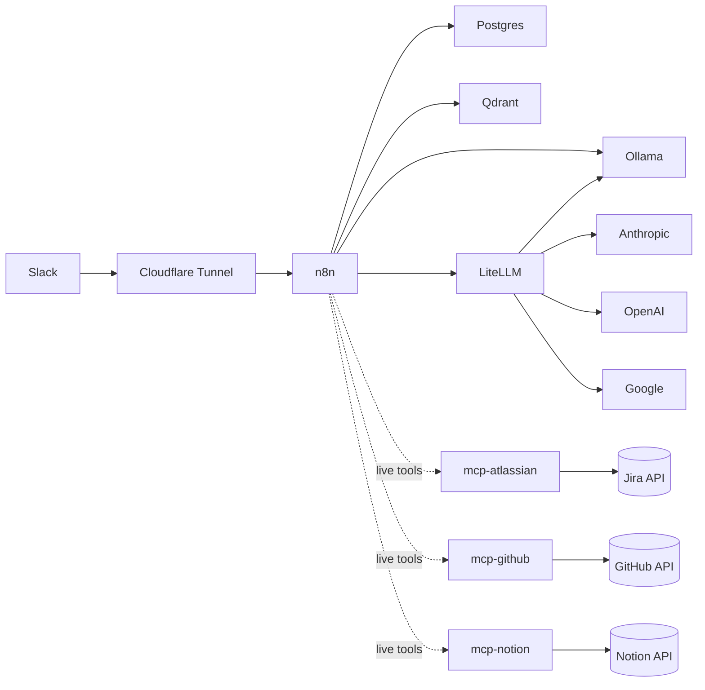

# Overview

Bugsy is a single-VM stack. One Compute Engine instance on GCP runs Docker Compose with all services. Internal services talk over a private docker network (`agent_agent-net`). Only Cloudflare Tunnel exposes anything to the internet.

## VM

| Property | Value |
|---|---|
| Provider | GCP Compute Engine |
| Name | `agent-vm` |
| RAM | 16 GB |
| OS | Ubuntu |
| Managed by | Terraform (`tf/`) |
| Repo on VM | `~/bugsy/` (git clone) |
| App dir | `~/agent/` → symlink to `~/bugsy/agent/` |

Cloud-init bootstraps the VM on first boot only. Any changes after that are deployed via `git pull` on the VM.

## Containers

| Container | Image | Role |
|---|---|---|
| `agent-postgres` | pgvector/pgvector:pg16 | Primary DB for app data + n8n internal DB + pgvector extension |
| `agent-qdrant` | qdrant/qdrant | Vector store for RAG (`personal_knowledge` collection) |
| `agent-redis` | redis:7-alpine | Cache / queue |
| `agent-ollama` | ollama/ollama | Local inference (CPU-only currently) — embedding model lives here |
| `agent-litellm` | ghcr.io/berriai/litellm | OpenAI-compatible proxy in front of Anthropic, OpenAI, Google, local models |
| `agent-openwebui` | ghcr.io/open-webui/open-webui | Chat UI (port 3000, internal) |
| `agent-n8n` | n8nio/n8n | Workflow automation, webhooks, AI Agent runtime |
| `agent-cloudflared` | cloudflare/cloudflared | Public ingress (Cloudflare Tunnel) |
| `agent-searxng` | searxng/searxng | Self-hosted metasearch for research workflows |
| `agent-mcp-atlassian` | ghcr.io/sooperset/mcp-atlassian | Live Jira read tool for Bugsy's AI Agent. SSE on :9000 (internal). |
| `agent-mcp-github` | ghcr.io/github/github-mcp-server | Live GitHub read tool (PRs, issues, code search). Streamable HTTP on :8082 (internal). |
| `agent-mcp-notion` | mcp/notion | Live Notion read/write tool — pages, blocks, databases, kanban properties, archives, comments, schema. Streamable HTTP on :3000 (internal). |

## Models available (via LiteLLM at `http://litellm:4000/v1`)

| Model name | Backend |
|---|---|
| `claude-sonnet-4-6` | Anthropic |
| `claude-haiku-4-5` | Anthropic |
| `gpt-4o-mini` | OpenAI |
| `gemini-2.5-pro` | Google |
| `gemini-2.5-flash` | Google |
| `qwen3` | Ollama local (qwen3:8b) |
| `nomic-embed-text` | Ollama local (embeddings, 768-dim) |

## Data flow at a glance

Cloudflare Tunnel is the only path in. n8n is the orchestration layer. Postgres holds chat memory and app data. Qdrant holds personal-knowledge embeddings. Ollama runs `nomic-embed-text` for local embeddings. LiteLLM brokers all chat-model calls so the workflow JSON only ever points at one URL.

The three MCP containers (`mcp-atlassian`, `mcp-github`, `mcp-notion`) give the AI Agent inside `bugsy.json` **live tools** for Jira, GitHub, and Notion. They sit on the same `agent-net` network — no Cloudflare exposure. Bugsy uses them to answer questions that need current state (e.g. "what's UTT-299's status?", "what PRs are open on coffey.codes?", "what's on the kanban this week?") instead of relying on the RAG-cached snapshots which go stale within hours. See [SPEC-MCP-001](../specs/active/SPEC-MCP-001-mcp-server-fleet-for-bugsy.md) for the fleet design and per-MCP details.
