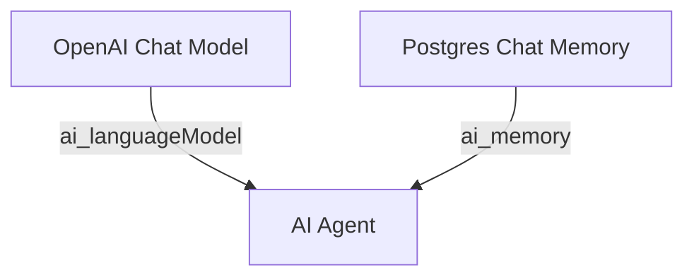

# Workflow reference generator

`agent/n8n/scripts/generate-workflow-reference.mjs` — Node.js script that turns every n8n workflow JSON file under `agent/n8n/workflows/` into a Markdown "Node Reference" section embedded inside the corresponding doc under `docs/workflows/`. JSON is the source of truth; this script keeps the docs honest without anyone having to hand-mirror node parameters.

## Why this exists

Hand-written node references go stale fast — change a node parameter in the n8n UI, re-export the JSON, and the markdown narrative quietly stops matching reality. The fix is to make the structural part of every workflow doc machine-derived from the JSON, while leaving the *narrative* part ("what this workflow does and why") fully hand-written.

Concretely, each workflow doc has two parts:

1. **Hand-written summary** above the marker — purpose, design tradeoffs, where things can go wrong, how to operate it.
2. **`## Node reference` block** between markers — auto-generated from the JSON. Mermaid flow diagram, then per-node detail (trigger params, code bodies, HTTP request shapes, credentials, LangChain agent prompts, etc.).

The generator only ever touches content between the markers. Narrative stays safe.

## Running it

```bash
# from the repo root, on a dev machine that has Node
node agent/n8n/scripts/generate-workflow-reference.mjs
```

That's the whole interface — no flags. It walks every `*.json` in `agent/n8n/workflows/`, locates or creates the corresponding doc, and writes the generated block. Output is a per-workflow line showing where each block landed.

**When to run it:**

- After editing a workflow JSON (whether by hand or by re-exporting from n8n)
- After adding a new workflow JSON (the script creates a stub doc automatically)
- After renaming a workflow's nodes or rewiring its connections

Commit the resulting markdown changes alongside the JSON change so the docs and source-of-truth stay in lockstep.

## Doc ownership

A single doc can describe one or many workflows. The mapping is declared via frontmatter on each doc:

```yaml
---
title: Bugsy Job Board Workflow
tags: [bugsy, job-board, llm-fit-score, n8n, workflow, postgres, slack]
n8n_workflows: [bugsy-job-board-fetcher, bugsy-job-board-ui]
---
```

The `n8n_workflows` array lists basenames (no `.json` extension) of the JSONs this doc covers. When the generator runs, it builds an ownership map from those frontmatter lists, then for each JSON:

1. If a doc claims this basename — write the generated block into that doc.
2. If not — create a stub at `docs/workflows/<basename>.md` with a placeholder narrative and the generated block.

The `job-board.md` doc is the canonical multi-workflow example — its frontmatter claims both the fetcher and the UI, and the file ends up holding two side-by-side node-reference blocks (one per workflow). Everything else in the repo is one-workflow-per-doc.

## Marker syntax

Each generated block is delimited by HTML-comment markers keyed on the workflow basename:

```markdown
<!-- NODE-REF:START:bugsy-rag-ingest — auto-generated by agent/n8n/scripts/generate-workflow-reference.mjs; do not edit by hand -->

## Node reference: Bugsy — RAG Ingest

> Auto-generated from `agent/n8n/workflows/bugsy-rag-ingest.json` on 2026-05-11. Run `node agent/n8n/scripts/generate-workflow-reference.mjs` to refresh.

... (mermaid flow + per-node detail) ...

<!-- NODE-REF:END:bugsy-rag-ingest -->
```

Editing anything between those markers by hand will be silently overwritten on the next regeneration. Edit the JSON or the renderer instead.

## What gets rendered per node type

The generator dispatches on `node.type` to a per-type renderer. Currently supported:

| `node.type` | Rendered as |
|---|---|
| `n8n-nodes-base.webhook` | Method, path, response mode |
| `n8n-nodes-base.scheduleTrigger` | Cron expression, timezone |
| `n8n-nodes-base.code` | Full `jsCode` body in a fenced ` ```javascript ` block |
| `n8n-nodes-base.set` | Bulleted list of `name = value (type)` assignments |
| `n8n-nodes-base.if` | Combinator + each condition as `left op right` |
| `n8n-nodes-base.httpRequest` | Method, URL, auth, timeout, headers, body (JSON or keypair) |
| `n8n-nodes-base.postgres` | Operation + fenced SQL block |
| `n8n-nodes-base.respondToWebhook` | Respond-with mode, status code, body |
| `n8n-nodes-base.slack` | Resource, operation, channel, text |
| `n8n-nodes-base.gmail` | Resource, operation, to/subject/body |
| `n8n-nodes-base.gmailTrigger` | Event, poll schedule, filters |
| `@n8n/n8n-nodes-langchain.openAi` | Model, temperature/max-tokens, each message in a fenced text block |
| `@n8n/n8n-nodes-langchain.agent` | Prompt type, system message |
| `@n8n/n8n-nodes-langchain.lmChatOpenAi` | Model, temperature |
| `@n8n/n8n-nodes-langchain.memoryPostgresChat` | Table, session key, context window |

**Unknown node types fall back to a JSON dump** of the node parameters. That's a deliberate choice — better to surface something than silently drop a node. If you start seeing JSON dumps in generated docs, that's the signal that the renderer needs a new dispatch case (see "Extending it" below).

Credentials are always shown by **name**, never by ID. Bugsy's credential IDs are sensitive enough that we don't want them leaking into committed docs.

## Mermaid flow

The flow diagram is emitted as `flowchart TD` (top-down) with one node per declared node and one edge per connection. Non-`main` connection types (LangChain wires `ai_languageModel` and `ai_memory` from sub-nodes into the parent agent) are rendered as labelled edges:



Node IDs are slugified from node names (lowercased, non-alphanumeric → underscores). Display labels keep the original names.

## Extending it

When n8n exposes a node type the generator doesn't know about yet, the JSON dump fallback kicks in. To add proper rendering:

1. **Write a renderer function** that takes the node's `parameters` object and returns a Markdown string:
   ```js
   function renderMyNewType(p) {
     return [
       `- **Some field:** \`${p.someField}\``,
       `- **Another:** \`${p.another}\``,
     ].join('\n');
   }
   ```

2. **Register it** in the `RENDERERS` map:
   ```js
   const RENDERERS = {
     // ...existing entries...
     'n8n-nodes-base.myNewType': renderMyNewType,
   };
   ```

3. **Re-run the generator.** Any workflow that uses the type now picks up the new rendering.

Keep renderers terse and use the existing helpers (`fence`, etc.). Code bodies belong in fenced blocks; one-line params belong in bullet lists. The renderers are not expected to be exhaustive — they should surface the fields a reader cares about when scanning, not every property n8n stores.

## Implementation notes

- **Pure Node, no dependencies.** Uses only `node:fs`, `node:path`, `node:url`. Runs on any Node 18+ install with no `npm install` step required.
- **Source-of-truth direction is one-way.** JSON → Markdown. The script never reads Markdown to update JSON. If you tweak a node in the n8n UI, you still need to re-export the JSON and commit it; the generator only mirrors that JSON into docs.
- **Stub creation is non-destructive.** If a workflow isn't claimed by any doc, the script creates a new doc. If a doc already exists at the basename path, it adds the workflow to its frontmatter and inserts the block.
- **Mid-run re-reads.** When two workflows share a doc (as `job-board.md` does), the script re-reads the doc between writes so the second block doesn't clobber the first.
- **Strict mkdocs-friendly.** The generator avoids cross-tree relative links into `agent/n8n/workflows/` because `mkdocs build --strict` rejects links to files outside the docs tree. The JSON path is referenced as a code-formatted string instead.

## Related

- [Deploying changes](deploy.md) — full deploy flow including this step
- [n8n workflow import](n8n-import.md) — how the markdown ends up paired with the running n8n state
- [agent/n8n/scripts/generate-workflow-reference.mjs](https://github.com/anthonycoffey/_agent/blob/main/agent/n8n/scripts/generate-workflow-reference.mjs) — the script itself (~270 lines, no deps)
