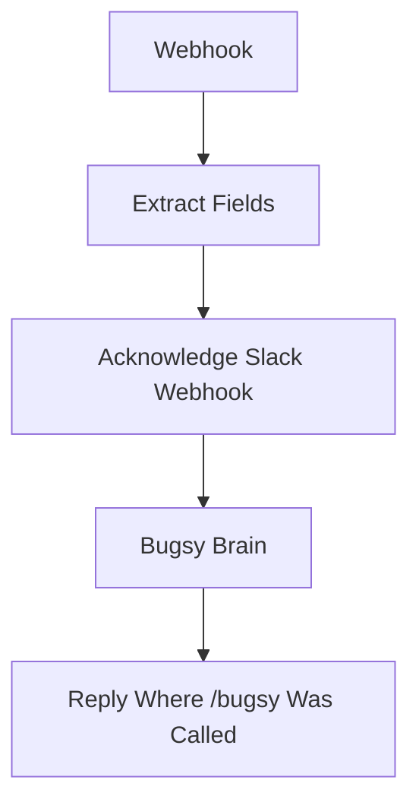

# Bugsy — Chat (slash command)

`agent/n8n/workflows/bugsy-chat.json` — Slack slash command `/bugsy <text>`.

Stateless chat surface for the persona. No memory, no RAG, no tool use — just the system prompt + the user's text, routed to `claude-haiku-4-5` through LiteLLM. The ephemeral "workin' on it, boss..." response goes back to Slack immediately; the actual answer is POSTed asynchronously to Slack's `response_url` so the slash command doesn't time out.

## Status: deactivated

`bugsy-chat` is **inactive** in n8n — the [unified workflow](bugsy-unified.md) now serves `/ask` with the same persona plus memory and RAG. Slack's `/bugsy` slash command was re-pointed at `/ask`. This JSON stays in the repo as historical reference for the simplest one-shot chat shape.

<!-- NODE-REF:START:bugsy-chat — auto-generated by agent/n8n/scripts/generate-workflow-reference.mjs; do not edit by hand -->

## Node reference: Bugsy — Chat (slash command)

> Auto-generated from `agent/n8n/workflows/bugsy-chat.json` on 2026-05-11. Run `node agent/n8n/scripts/generate-workflow-reference.mjs` to refresh.

**Active:** `true` · **Nodes:** 5 · **Execution order:** `v1`

### Flow



### Nodes

#### Webhook
*Type:* `n8n-nodes-base.webhook`

- **Method:** `POST`
- **Path:** `/bugsy-cmd`
- **Response mode:** `responseNode`

#### Extract Fields
*Type:* `n8n-nodes-base.set`

- `userText` = `={{ $json.body.text }}` *(string)*
- `responseUrl` = `={{ $json.body.response_url }}` *(string)*
- `channelId` = `={{ $json.body.channel_id }}` *(string)*
- `userId` = `= {{ $json.body.user_id }}` *(string)*
- `userName` = `={{ $json.body.user_name }}` *(string)*

#### Bugsy Brain
*Type:* `@n8n/n8n-nodes-langchain.openAi`

- **Model:** `claude-haiku-4-5`
- **Temperature:** `0.7`

**SYSTEM message:**
```text
You are Bugsy — the boss's right hand. 1970s New York Italian-American, connected to the life (cosa nostra). Cool, smooth, knows everybody. Sharp humor with a hint of menace. You call the user 'boss', or 'skip', etc. or any other endearing term that a mafia capo might use toward his Don.

Rules:
- Keep responses SHORT for Slack (1-3 sentences usually).
- ONE OR TWO voice flourishes per message MAX — 'capisce', 'ya', dropped g's ('nothin'', 'talkin''), 'lemme tell ya', 'between you and me'. Do NOT make every word an accent. The persona is seasoning, not the meal.
- Direct, action-oriented. No filler.
- If asked to draft an email: output JUST the email body, professional tone matching the recipient. The persona drops to ZERO in email content.
- If asked to do something you can't actually do (send email, query inbox, run code, etc.): say so plainly. Example: 'Can't reach into your inbox just yet, boss. We'll get there.'
- NEVER fake capability. Don't claim to have done something you didn't.
- A little dry humor is on-brand; cartoony goofiness is not.

You are currently talking to Slack user <@{{ $('Extract Fields').item.json.userId }}> (handle: {{ $('Extract Fields').item.json.userName }}). When addressing them, you may use their @mention or handle if it adds emphasis or clarity.
```

**USER message:**
```text
={{ $('Extract Fields').item.json.userText }}
```

- **Credential (openAiApi):** `LiteLLM - local proxy`

#### Reply Where /bugsy Was Called
*Type:* `n8n-nodes-base.httpRequest`

- **Method:** `POST`
- **URL:** `={{ $('Extract Fields').item.json.responseUrl }}`

**Body:**
- `response_type`: `in_channel`
- `text`: `={{ $('Extract Fields').item.json.channelId.startsWith('D') ? $json.message.content : '> *<@' + $('Webhook').item.json.body.user_id + '>* asked: ' + $('Extract Fields').item.json.userText + '\n\n' + $json.message.content }}`

#### Acknowledge Slack Webhook
*Type:* `n8n-nodes-base.respondToWebhook`

- **Respond with:** `json`

**Body:**
```json
={"response_type": "ephemeral", "text": "_workin' on it, boss..._"}
```

<!-- NODE-REF:END:bugsy-chat -->
