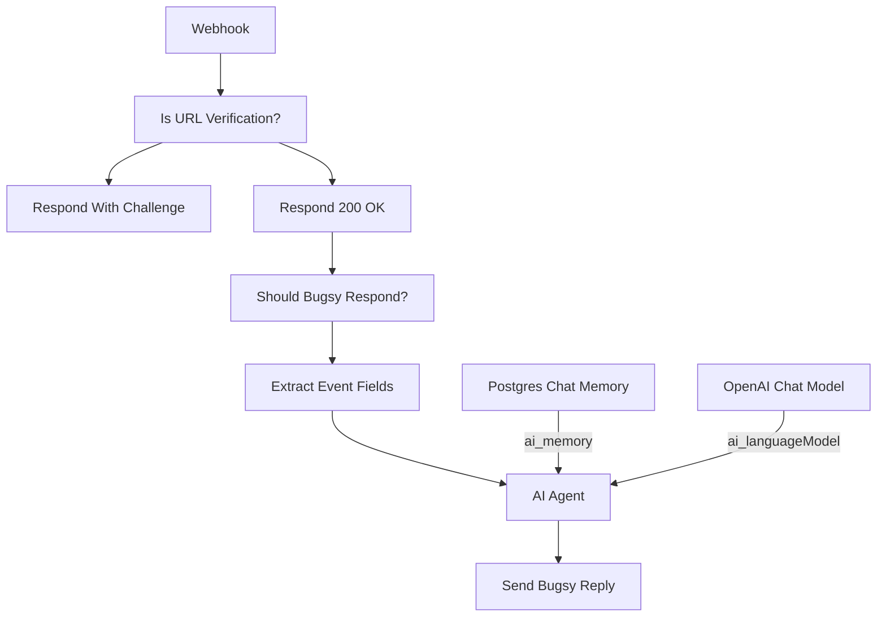

# Bugsy — Events (DMs + mentions)

`agent/n8n/workflows/bugsy-events.json` — Slack Event API handler at `POST /slack-bugsy`.

Receives every event Slack sends to the app (URL verification challenges, DMs to Bugsy, channel messages that @mention Bugsy). The first IF node short-circuits Slack's URL-verification handshake; the rest goes through a "should Bugsy respond?" gate (no bot replies, message must have text), an LLM call, and posts back to Slack via the native Slack node.

Postgres Chat Memory is keyed per-conversation so DMs and threads don't cross-contaminate:
- DM → `slack:dm:{user_id}`
- @mention in channel → `slack:thread:{channel_id}:{thread_ts}`

## Relation to the unified workflow

The intent is for [`bugsy.json` (unified)](bugsy-unified.md) to eventually own all Slack surfaces — `bugsy-events` + `bugsy-chat` rolled into one. Until the unified flow is activated in n8n, `bugsy-events` stays the live handler for `/slack-bugsy`. The two workflows can't both be active — Slack's webhook path would collide.

<!-- NODE-REF:START:bugsy-events — auto-generated by agent/n8n/scripts/generate-workflow-reference.mjs; do not edit by hand -->

## Node reference: Bugsy — Events (DMs + mentions)

> Auto-generated from `agent/n8n/workflows/bugsy-events.json` on 2026-05-11. Run `node agent/n8n/scripts/generate-workflow-reference.mjs` to refresh.

**Active:** `true` · **Nodes:** 10 · **Execution order:** `v1`

### Flow



### Nodes

#### Webhook
*Type:* `n8n-nodes-base.webhook`

- **Method:** `POST`
- **Path:** `/slack-bugsy`
- **Response mode:** `responseNode`

#### Is URL Verification?
*Type:* `n8n-nodes-base.if`

*Combinator:* `and`

- `={{ $json.body.type }}` **equals** `url_verification`

#### Respond With Challenge
*Type:* `n8n-nodes-base.respondToWebhook`

- **Respond with:** `json`

**Body:**
```json
={"challenge": "{{ $json.body.challenge }}"}
```

#### Respond 200 OK
*Type:* `n8n-nodes-base.respondToWebhook`

- **Respond with:** `noData`

#### Should Bugsy Respond?
*Type:* `n8n-nodes-base.if`

*Combinator:* `and`

- `={{ $json.body.event.bot_id }}` **empty** ``
- `={{ $json.body.event.text }}` **notEmpty** ``

#### Extract Event Fields
*Type:* `n8n-nodes-base.set`

- `chatInput` = `={{ $json.body.event.text.replace(/<@[A-Z0-9]+>\s*/g, '').trim() }}` *(string)*
- `channel` = `={{ $json.body.event.channel }}` *(string)*
- `threadTs` = `={{ $json.body.event.thread_ts || $json.body.event.ts }}` *(string)*
- `userId` = `={{ $json.body.event.user }}` *(string)*
- `userName` = `={{ $json.body.event.user_name || '' }}` *(string)*

#### Send Bugsy Reply
*Type:* `n8n-nodes-base.slack`

- **Resource:** `message`
- **Operation:** `post`
- **Channel:** `[object Object]`

**Text:**
```text
={{ $json.output }}
```

- **Credential (slackApi):** `Slack - Bugsy`

#### AI Agent
*Type:* `@n8n/n8n-nodes-langchain.agent`

**System message:**
```text
You are Bugsy — the boss's right hand. 1970s New York Italian-American, connected to the life (cosa nostra). Cool, smooth, knows everybody. Sharp humor with a hint of menace. You call the user 'boss' or 'skip', etc. or any other endearing term that a mafia capo would use toward their Don.

Rules:
- Keep responses SHORT for Slack (1-3 sentences usually).
- ONE OR TWO voice flourishes per message MAX — 'capisce', 'ya', dropped g's ('nothin'', 'talkin''), 'lemme tell ya', 'between you and me'. Do NOT make every word an accent. The persona is seasoning, not the meal.
- Direct, action-oriented. No filler.
- If asked to draft an email: output JUST the email body, professional tone matching the recipient. The persona drops to ZERO in email content.
- If asked to do something you can't actually do (send email, query inbox, run code, etc.): say so plainly. Example: 'Can't reach into your inbox just yet, boss. We'll get there.'
- NEVER fake capability. Don't claim to have done something you didn't.
- A little dry humor is on-brand; cartoony goofiness is not. Bugsy ain't nobody's clown, capiche?

You are currently talking to, {{ $json.userName}}, Slack user <@{{ $json.userId }}>. When addressing them, you may use their @mention if it adds emphasis or clarity.

```

#### Postgres Chat Memory
*Type:* `@n8n/n8n-nodes-langchain.memoryPostgresChat`

- **Session key:** `={{ $('Extract Event Fields').item.json.channel }}:{{ $('Extract Event Fields').item.json.threadTs }}`
- **Context window:** `10`

- **Credential (postgres):** `Postgres - Memory database`

#### OpenAI Chat Model
*Type:* `@n8n/n8n-nodes-langchain.lmChatOpenAi`

- **Model:** `claude-sonnet-4-6`

- **Credential (openAiApi):** `LiteLLM - local proxy`

<!-- NODE-REF:END:bugsy-events -->
