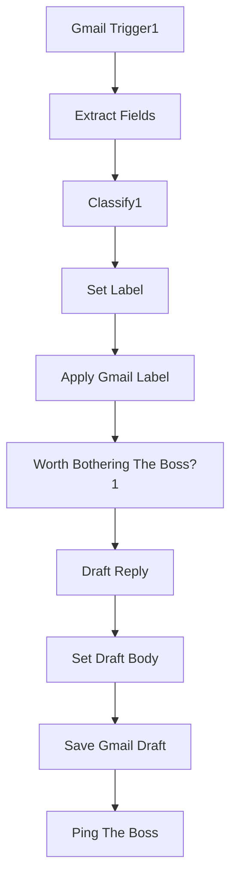

# Bugsy — Inbox Watcher (gmail)

`agent/n8n/workflows/bugsy-inbox-watcher.json` — Gmail-trigger that polls Anthony's inbox every minute and pre-processes new mail before it reaches a human.

## What it does

1. **Gmail Trigger** fires for every new email (every-minute poll).
2. **Classify1** — `claude-haiku-4-5` slots the email into exactly one of `important | needs_reply | scheduling | promo`. Temperature 0; output is a single label word.
3. **Set Label** + **Apply Gmail Label** — tag the message with a corresponding Gmail label so the inbox visually segments itself.
4. **Worth Bothering The Boss?** — IF gate that filters out `promo`. Anything important/needs_reply/scheduling passes through.
5. **Draft Reply** — `claude-haiku-4-5` writes a response draft in Anthony's voice. Persona drops to zero in email content per the chat persona rules.
6. **Save Gmail Draft** — stores the draft in Gmail so Anthony can review and hit Send.
7. **Ping The Boss** — Slack notification that a new draft is waiting.

## Why this shape

Bugsy can't safely auto-send email — too many edge cases, too much reputational risk. But classifying + drafting are cheap and the human-in-the-loop send keeps quality high. Net effect: inbox arrives pre-sorted, with replies started for everything that needs one.

<!-- NODE-REF:START:bugsy-inbox-watcher — auto-generated by agent/n8n/scripts/generate-workflow-reference.mjs; do not edit by hand -->

## Node reference: Bugsy — Inbox Watcher (gmail)

> Auto-generated from `agent/n8n/workflows/bugsy-inbox-watcher.json` on 2026-05-11. Run `node agent/n8n/scripts/generate-workflow-reference.mjs` to refresh.

**Active:** `true` · **Nodes:** 10 · **Execution order:** `v1`

### Flow



### Nodes

#### Gmail Trigger1
*Type:* `n8n-nodes-base.gmailTrigger`

- **Poll:** {"mode":"everyMinute"}

**Filters:**
```json
{}
```

- **Credential (gmailOAuth2):** `Gmail - Bugsy (anthony@coffey.codes)`

#### Classify1
*Type:* `@n8n/n8n-nodes-langchain.openAi`

- **Model:** `claude-haiku-4-5`
- **Temperature:** `0`

**SYSTEM message:**
```text
You are an email triage classifier. Every email must be classified into exactly ONE of these four buckets:

important | needs_reply | scheduling | promo

Definitions:
- important: time-sensitive; money, legal, security, urgent matters from real people
- needs_reply: a real human asking a question or making a request that expects a written response
- scheduling: meeting requests, calendar coordination, availability asks
- promo: newsletters, marketing emails, sales pitches, mass mailings, product announcements

If an email doesn't clearly fit any of these, default to needs_reply.

Examples:
"Can you confirm Tuesday 2pm works?" → scheduling
"What's our refund policy?" → needs_reply
"50% off everything!" → promo
"URGENT: payment failed for customer X" → important
"Just wanted to share an article I found interesting" → needs_reply

Output ONLY the label word. No punctuation. No explanation.
```

**USER message:**
```text
From: {{ $json.from }}
Subject: {{ $json.subject }}
Snippet: {{ $json.snippet }}
```

- **Credential (openAiApi):** `LiteLLM - local proxy`

#### Worth Bothering The Boss?1
*Type:* `n8n-nodes-base.if`

*Combinator:* `or`

- `={{ $('Set Label').item.json.label }}` **equals** `needs_reply`
- `={{ $('Set Label').item.json.label }}` **equals** `important`

#### Extract Fields
*Type:* `n8n-nodes-base.set`

- `from` = `=	{{ $json.from.text }}` *(string)*
- `subject` = `={{ $json.subject }}` *(string)*
- `snippet` = `={{ $json.text.substring(0, 300) }}` *(string)*
- `messageId` = `={{ $json.id }}` *(string)*
- `threadId` = `=	{{ $json.threadId }}` *(string)*
- `account` = `anthony@coffey.codes` *(string)*

#### Set Label
*Type:* `n8n-nodes-base.set`

- `label` = `={{ $json.message.content.trim().toLowerCase() }}` *(string)*

#### Apply Gmail Label
*Type:* `n8n-nodes-base.gmail`

- **Resource:** `message`
- **Operation:** `addLabels`

- **Credential (gmailOAuth2):** `Gmail - Bugsy (anthony@coffey.codes)`

#### Draft Reply
*Type:* `@n8n/n8n-nodes-langchain.openAi`

- **Model:** `gpt-4o-mini`
- **Temperature:** `0.7`

**SYSTEM message:**
```text
You are Bugsy, the boss's right-hand. You write reply drafts for the boss to review. Voice: 1920s NY Italian-American mobster — confident, warm, direct. Use sparing voice flourishes ('capisce', 'boss', 'ya') — one or two per message MAX. Underneath the voice the content must be CORRECT, PROFESSIONAL, and appropriate for the recipient. The boss reviews and tweaks before sending. Match the formality of the inbound email — if it's casual, you're casual; if it's a client, dial back the persona to a single warm greeting.

Output ONLY the email body. No subject line, no [Name] placeholders, no signature — write as if you're the boss replying.
```

**USER message:**
```text
From: {{ $json.from }}
Subject: {{ $json.subject }}
Snippet: {{ $json.snippet }}

Write a reply draft from the boss.
```

- **Credential (openAiApi):** `LiteLLM - local proxy`

#### Set Draft Body
*Type:* `n8n-nodes-base.set`

- `draftBody` = `={{ $json.message.content }}` *(string)*

#### Save Gmail Draft
*Type:* `n8n-nodes-base.gmail`

- **Resource:** `draft`
- **Operation:** `send`
- **Subject:** `=Re: {{ $('Extract Fields').item.json.subject }}`

**Message:**
```text
={{ $json.draftBody }}
```

- **Credential (gmailOAuth2):** `Gmail - Bugsy (anthony@coffey.codes)`

#### Ping The Boss
*Type:* `n8n-nodes-base.slack`

- **Resource:** `message`
- **Operation:** `post`

**Text:**
```text
=Heya boss — got a {{ $('Set Label').item.json.label }} one ova heah.

*From:* {{ $('Extract Fields').item.json.from }}
*Subject:* {{ $('Extract Fields').item.json.subject }}

Drafted ya a reply, sittin' in ya drafts folder waitin' on the once-over. Capisce?
```

- **Credential (slackApi):** `Slack - Bugsy`

<!-- NODE-REF:END:bugsy-inbox-watcher -->
