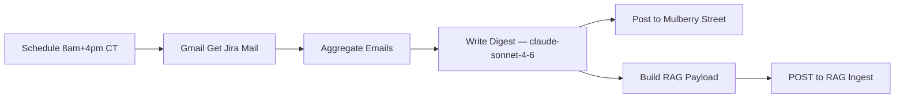
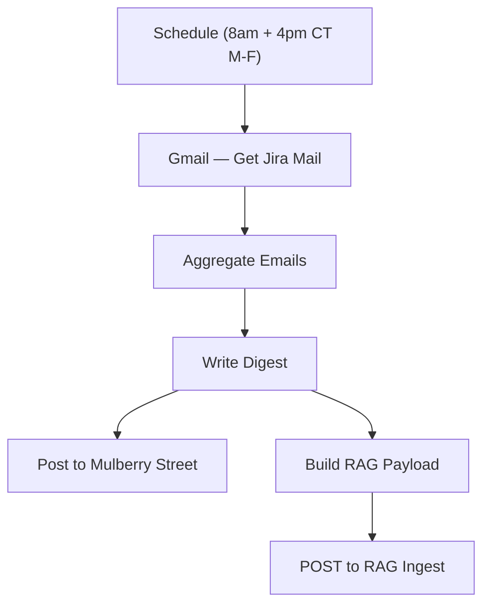

# Jira digest

`agent/n8n/workflows/bugsy-jira-digest.json` — twice-a-day digest of Jira notification mail from `jira@ultrasoundai.atlassian.net`, posted to `#mulberry-street` (channel id `C0AV83XUSTU`) with summary + action items and every ticket key linkified to the UltrasoundAI workspace.

## Schedule

Cron `0 8,16 * * 1-5` in `America/Chicago` — **8:00 AM and 4:00 PM CT, Mon–Fri**. No state in Postgres; each run queries `newer_than:1d` so there's intentional overlap between runs. **Aggregate Emails** tags each email FRESH or STALE based on a 9h cutoff so the LLM reports only current-window activity and uses older mail as context — see [Temporal accuracy guardrail](#temporal-accuracy-guardrail).

## Pipeline



- **Gmail — Get Jira Mail** uses Gmail search `from:jira@ultrasoundai.atlassian.net newer_than:1d`. `alwaysOutputData: true` so the downstream chain runs even on empty inboxes.
- **Aggregate Emails** strips HTML, truncates each body to 1200 chars, and folds all messages into one big text block with `--- Email N [FRESH|STALE] ---` separators. Tags each email **FRESH** (received at or after `now - 9h`) or **STALE** (older) and surfaces its Gmail `internalDate` as a `Received:` ISO timestamp so the LLM has explicit temporal signal. Prepends a `DIGEST WINDOW` header with the current time and the freshness cutoff. Outputs `{ count, emails, cutoff, now }`. Returns `(no Jira mail in the window)` when the inbox is empty so the LLM can produce a quiet-shift one-liner. See [Temporal accuracy guardrail](#temporal-accuracy-guardrail) for the rationale.
- **Write Digest** is a single-shot LLM call against `claude-sonnet-4-6` via LiteLLM. System prompt enforces persona (sparing, max two flourishes), output structure (`*Summary*` + `*Action Items*`), the strict link-format rule for ticket IDs, and the FRESH/STALE rule (only FRESH events get reported; STALE emails are context only).
- **Post to Mulberry Street** sends the result to channel `C0AV83XUSTU` with `unfurl_links: false` and `unfurl_media: false` so the linkified ticket IDs don't blow up the message with Atlassian previews.
- **Build RAG Payload** (parallel branch) wraps the digest body in YAML frontmatter and builds the `/rag-ingest` request body. See [RAG ingestion](#rag-ingestion) below.
- **POST to RAG Ingest** fires the request at `https://n8n.coffey.codes/webhook/rag-ingest` with `onError: continueRegularOutput` so a RAG failure can't break the Slack branch (which runs concurrently off the same `Write Digest` output).

## Output format

Two sections in Slack mrkdwn:

```
*Summary*
<2-5 short paragraphs, grouped by ticket where useful>

*Action Items*
• <one bullet per action, ticket IDs as <https://ultrasoundai.atlassian.net/browse/UTT-123|UTT-123>>
```

Empty-inbox runs collapse to a single in-voice line.

## RAG ingestion

Each digest is mirrored into Qdrant via the same `/rag-ingest` webhook the bulk `rag-ingest.sh` helper uses — but **without ever writing a file under `~/agent/rag/`**. The content is held in-memory by n8n, chunked, embedded, and upserted directly.

**Why this is safe vs. the bulk script.** `rag-ingest.sh` only walks four hardcoded category directories (`bio`, `articles`, `case-studies`, `projects`) and its orphan-purge pass is category-scoped + exact-match on filename. Because this branch uses category `jira-digests` and filename prefix `jira/…`, the shell script literally has no knowledge of these points and can never purge them, even on a clean re-run with no Jira files on disk.

**Payload contract** (built in **Build RAG Payload**):

```json
{
  "category": "jira-digests",
  "filename": "jira/<ISO8601-execution-start>.md",
  "content": "---\ntitle: Jira Digest <ISO>\ntags: [jira, digest, work-email]\n---\n\n<digest mrkdwn body>"
}
```

- **Filename** uses `$now.toISO()` captured at execution start. Each cron fire (8am + 4pm CT) produces its own document; a retry of the *same* execution overwrites in-place (Qdrant point IDs are deterministic UUIDs seeded by `filename + chunk_index`, see [bugsy-rag-ingest.md](bugsy-rag-ingest.md)). Distinct fires never collide.
- **Tags** are static. We rely on Qdrant's payload filtering (`category = "jira-digests"`) to scope retrieval, not per-ticket tags — Bugsy's RAG retriever already pulls by semantic similarity, and the digest body itself carries the linkified ticket IDs the embedder will index.
- **Frontmatter title** carries the run timestamp so a recall like "what did the Jira digest say this morning?" surfaces the right doc.

**Failure mode.** The HTTP node uses `onError: continueRegularOutput`. If the webhook is down, returns non-2xx, or times out, the Slack post still ships — only the RAG enrichment is missed for that fire, and the next fire fills the gap. No retry, no alert.

## Why `<URL|TEXT>` for ticket IDs

Slack mrkdwn link syntax is `<URL|display>`. When display text is supplied (not just a bare URL), Slack typically suppresses link previews on its own — and the node also sets `unfurl_links` + `unfurl_media` to `false` belt-and-suspenders. A message with 15 tickets stays a single tight digest instead of a tower of unfurled cards.

## Credentials

| Slot | Credential | Notes |
|---|---|---|
| Gmail | `Gmail - Bugsy (anthony@bitmotive.com)` | OAuth2, work account. The credential id `ScdvtlZU9jnWCan2` is bound in the JSON — re-binding only needed if you build a fresh n8n instance. |
| LiteLLM | `LiteLLM - local proxy` | Already in n8n — same one every other workflow uses. |
| Slack | `Slack - Bugsy` | Already in n8n. |

## Temporal accuracy guardrail

The Gmail filter pulls a 24h window (`newer_than:1d`), so on a typical 8h cron cadence each digest sees the previous 24h of mail — roughly 16h of overlap with the prior digest. Without intervention, the LLM treats every email it sees as "recent activity," which is how closed tickets re-surface in subsequent digests as if they were still in-flight (the closure email survives multiple 24h windows; the closure note recurs in quoted activity tails of later notifications). See [BUG-JIRA-001](../specs/active/BUG-JIRA-001-digest-reports-completed-tickets-as-current.md).

Two-part fix wired into the pipeline:

**1. Aggregate Emails tags each email FRESH or STALE** based on a 9h cutoff (covers the 8h cron gap with buffer):

```
DIGEST WINDOW
Now: 2026-05-17T21:00:00.000Z
Fresh cutoff: 2026-05-17T12:00:00.000Z (events received at or after this time are FRESH; earlier events are STALE)

--- Email 1 [FRESH] ---
Received: 2026-05-17T18:42:11.000Z
From: jira@ultrasoundai.atlassian.net
Subject: [JIRA] (UTT-1234) ...
Body: ...
```

**2. The system prompt teaches the LLM how to use the tags** — only FRESH emails describe events to report; STALE emails are context only, used so the LLM can interpret FRESH events that reference them. The REQUIREMENTS block closes with:

```
REQUIREMENTS:
1. THE OUTPUT MUST BE TEMPORALLY ACCURATE. Only [FRESH] emails describe events to report; [STALE] emails are context only. Never report a [STALE]-only event as current activity.
2. LOOK AT 'Received:' TIMESTAMPS to order events within a ticket. The most recent [FRESH] event wins when describing current state.
3. CLOSED TICKETS USE PAST TENSE and do not appear in *Action Items* unless the closure itself requires the boss's attention.
```

The cutoff is hardcoded to 9h. If the cron schedule changes, the cutoff in `Aggregate Emails` (`CUTOFF_HOURS`) needs to change to match (or slightly exceed) the gap between fires.

## Tuning

- **Cadence too sparse?** Change cron to `0 8,12,16 * * 1-5` (3x/day) or `0 8-18/2 * * 1-5` (every 2h in business hours).
- **Different project key?** Sender filter is workspace-scoped (`jira@<workspace>.atlassian.net`) so it auto-includes every project you receive mail for. The Jira URL pattern in the system prompt is hardcoded to `ultrasoundai.atlassian.net` — edit there if you need a different host.
- **Too noisy?** Tighten the Gmail filter, e.g. `from:jira@ultrasoundai.atlassian.net AND -subject:"watching"` to drop "you are now watching" emails.
- **Want richer action items?** Bump model to `claude-opus-4-7` (slower, smarter) or feed more body bytes — raise the 1200-char truncate in `Aggregate Emails`.

## See also

- [Inbox Watcher](bugsy-inbox-watcher.md) — per-email triage on the personal Gmail (different pattern, currently inactive)

<!-- NODE-REF:START:bugsy-jira-digest — auto-generated by agent/n8n/scripts/generate-workflow-reference.mjs; do not edit by hand -->

## Node reference: Bugsy — Jira Digest (work email)

> Auto-generated from `agent/n8n/workflows/bugsy-jira-digest.json` on 2026-05-18. Run `node agent/n8n/scripts/generate-workflow-reference.mjs` to refresh.

**Active:** `false` · **Nodes:** 7 · **Execution order:** `v1`

### Flow



### Nodes

#### Schedule (8am + 4pm CT M-F)
*Type:* `n8n-nodes-base.scheduleTrigger`

- **Schedule:** cron `0 8,16 * * 1-5`
- **Timezone:** `America/Chicago`

#### Gmail — Get Jira Mail
*Type:* `n8n-nodes-base.gmail`

- **Resource:** `message`
- **Operation:** `getAll`

- **Credential (gmailOAuth2):** `Gmail - Bugsy (anthony@bitmotive.com)`

#### Aggregate Emails
*Type:* `n8n-nodes-base.code`

```javascript
const emails = $('Gmail — Get Jira Mail').all();

// Digest window: the LLM should treat events within the last 9h as FRESH
// (covers both the 8h gap between cron fires and a small buffer).
// Older events are STALE — context from previous digests, not current activity.
// We keep the 24h Gmail filter to avoid dropping emails on missed runs;
// the FRESH/STALE tagging lets the LLM decide what to report.
const now = new Date();
const CUTOFF_HOURS = 9;
const cutoff = new Date(now.getTime() - CUTOFF_HOURS * 3600 * 1000);

// Strip HTML so the LLM gets clean text instead of markup
const stripHtml = (s) => String(s || '')
  .replace(/<style[\s\S]*?<\/style>/gi, ' ')
  .replace(/<script[\s\S]*?<\/script>/gi, ' ')
  .replace(/<[^>]+>/g, ' ')
  .replace(/&nbsp;/g, ' ')
  .replace(/&amp;/g, '&')
  .replace(/&lt;/g, '<')
  .replace(/&gt;/g, '>')
  .replace(/\s+/g, ' ')
  .trim();

// Try several places Gmail node v2.1 might expose the receive timestamp,
// in priority order. The canonical field is `internalDate` (ms since epoch
// as string) but it isn't always populated; fall back to the parsed `date`
// header, then to scanning the raw headers array, then to now-as-last-resort.
const extractMs = (j) => {
  if (j.internalDate) {
    const n = parseInt(j.internalDate, 10);
    if (Number.isFinite(n) && n > 0) return n;
  }
  if (j.date) {
    const n = Date.parse(j.date);
    if (Number.isFinite(n)) return n;
  }
  if (Array.isArray(j.headers)) {
    const h = j.headers.find(x => x && x.name && x.name.toLowerCase() === 'date');
    if (h && h.value) {
      const n = Date.parse(h.value);
      if (Number.isFinite(n)) return n;
    }
  }
  return null;
};

const header = `DIGEST WINDOW\nNow: ${now.toISOString()}\nFresh cutoff: ${cutoff.toISOString()} (events received at or after this time are FRESH; earlier events are STALE)\n`;

if (!emails.length || (emails.length === 1 && !emails[0].json?.id)) {
  return [{ json: { count: 0, emails: header + '\n(no Jira mail in the window)', cutoff: cutoff.toISOString(), now: now.toISOString() } }];
}

const lines = emails.map((it, i) => {
  const j = it.json || {};
  const internalMs = extractMs(j);
  const received = internalMs ? new Date(internalMs).toISOString() : 'unknown';
  // If we couldn't extract a timestamp at all, default to FRESH so the email
  // still surfaces — the LLM will see 'Received: unknown' and treat the email
  // as in-window but flag the missing temporal signal in its output.
  const isFresh = internalMs ? (internalMs >= cutoff.getTime()) : true;
  const tag = isFresh ? 'FRESH' : 'STALE';
  const from = (j.from && j.from.text) ? j.from.text : (j.from || j.From || '?');
  const subject = j.subject || j.Subject || '?';
  const snippet = j.snippet || '';
  const body = stripHtml(j.text || j.html || '').substring(0, 1200);
  return `--- Email ${i + 1} [${tag}] ---\nReceived: ${received}\nFrom: ${from}\nSubject: ${subject}\nSnippet: ${snippet}\nBody: ${body}`;
}).join('\n\n');

return [{ json: { count: emails.length, emails: header + '\n' + lines, cutoff: cutoff.toISOString(), now: now.toISOString() } }];
```

#### Write Digest
*Type:* `@n8n/n8n-nodes-langchain.openAi`

- **Model:** `claude-sonnet-4-6`
- **Temperature:** `0.5`

**SYSTEM message:**
```text
You are Bugsy, the boss's right-hand. Voice: 1970s NY Italian-American mobster — confident, warm, direct with the classic new yorker accent. Use voice flourishes (capisce, boss, skip, hey! ho!) SPARINGLY — at MOST two across the whole digest, ideally in the opener and closer. Underneath the voice the content must be CORRECT, ACCURATE, and PROFESSIONAL.

You're reading a digest of Jira notification emails from ultrasoundai.atlassian.net (subject prefix '[JIRA]', project key UTT). Produce ONE Slack message in Slack mrkdwn with two sections:

*Summary*
What's moved on the project since the last digest. Group activity by ticket where it makes sense. Call out: blockers, status changes, priority shifts, deadlines, who's waiting on whom. Just a few short paragraphs. Condensed, succinct; not chatty.

*Action Items*
Concrete things the boss has to DO. One bullet per item starting with •. Cover:
- tickets newly assigned to him
- @mentions calling him out
- review or approval requests
- status changes that need a response from him
- threads where someone is waiting on his input
- work that obviously needs a ticket but doesn't have one — suggest creating, label '(no ticket yet)'

TEMPORAL CONTEXT — read this CAREFULLY:
- The input starts with a 'DIGEST WINDOW' block that gives the current time and the 'Fresh cutoff' time. Use these as ground truth.
- Each email is tagged [FRESH] or [STALE] in its header. [FRESH] = received at or after the cutoff (this digest's window). [STALE] = received earlier (already covered in a prior digest, or unrelated to this window).
- Each email also has an explicit 'Received:' ISO timestamp — use it when ordering events for one ticket.
- ONLY [FRESH] emails describe activity to report. [STALE] emails are CONTEXT — they exist so you can interpret [FRESH] events that reference them (e.g. 'the ticket Bob closed yesterday was reopened today'). Do NOT include a [STALE]-only event in *Summary* or *Action Items*.
- Inside any email body, Jira often quotes prior comments and historical activity. The 'Received:' timestamp applies to the EMAIL, not to the events quoted inside it. If a body mentions a status change that you've already seen in a [STALE] email, treat it as old context, not new activity.
- A ticket whose most recent [FRESH] event is a status change to Done / Closed / Resolved / Cancelled was COMPLETED. Use past tense ('closed UTT-NNN at HH:MM'). Do NOT include closed tickets as action items unless the closure itself demands a response (e.g. a ticket assigned to the boss got closed by someone else unexpectedly).

FORMATTING RULES — strict:
- EVERY ticket ID (UTT-NNN) must be a hyperlink in this exact form: <https://ultrasoundai.atlassian.net/browse/UTT-NNN|UTT-NNN>. No bare 'UTT-123' anywhere.
- Slack markdown only: *bold*, _italic_, `code`, bullets with •.
- No markdown headers (no `#`), no tables.
- No closing signature.
- Keep it tight. If something's repeated across emails (same comment quoted back), mention once.

If there are no [FRESH] emails at all (every email is [STALE] or the input says '(no Jira mail in the window)'): respond with a one-liner in voice, e.g. 'Quiet shift, boss — nothin' worth ya time on the Jira front.'

Output the message body ONLY — no preamble, no 'Here is your digest:'.

REQUIREMENTS:
1. THE OUTPUT MUST BE TEMPORALLY ACCURATE. Only [FRESH] emails describe events to report; [STALE] emails are context only. Never report a [STALE]-only event as current activity.
2. LOOK AT 'Received:' TIMESTAMPS to order events within a ticket. The most recent [FRESH] event wins when describing current state.
3. CLOSED TICKETS USE PAST TENSE and do not appear in *Action Items* unless the closure itself requires the boss's attention.
```

**USER message:**
```text
={{ $json.emails }}
```

- **Credential (openAiApi):** `LiteLLM - local proxy`

#### Post to Mulberry Street
*Type:* `n8n-nodes-base.slack`

- **Resource:** `message`
- **Operation:** `post`
- **Channel:** `mulberry-street (C0AV83XUSTU)`

**Text:**
```text
={{ $json.message.content }}
```

- **Credential (slackApi):** `Slack - Bugsy`

#### Build RAG Payload
*Type:* `n8n-nodes-base.code`

```javascript
const body = $input.first().json.message.content;
const ts = $now.toISO();
const filename = `jira/${ts}.md`;
const frontmatter = `---\ntitle: Jira Digest ${ts}\ntags: [jira, digest, work-email]\n---\n\n`;
return [{ json: {
  category: 'jira-digests',
  filename,
  content: frontmatter + body,
} }];
```

#### POST to RAG Ingest
*Type:* `n8n-nodes-base.httpRequest`

- **Method:** `POST`
- **URL:** `https://n8n.coffey.codes/webhook/rag-ingest`
- **Timeout:** 60000ms

**Headers:**
- `Content-Type`: `application/json`

**Body:**
```json
={{ JSON.stringify($json) }}
```

- **On error:** `continueRegularOutput`

<!-- NODE-REF:END:bugsy-jira-digest -->
