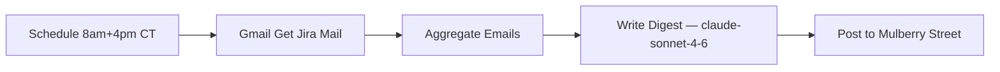
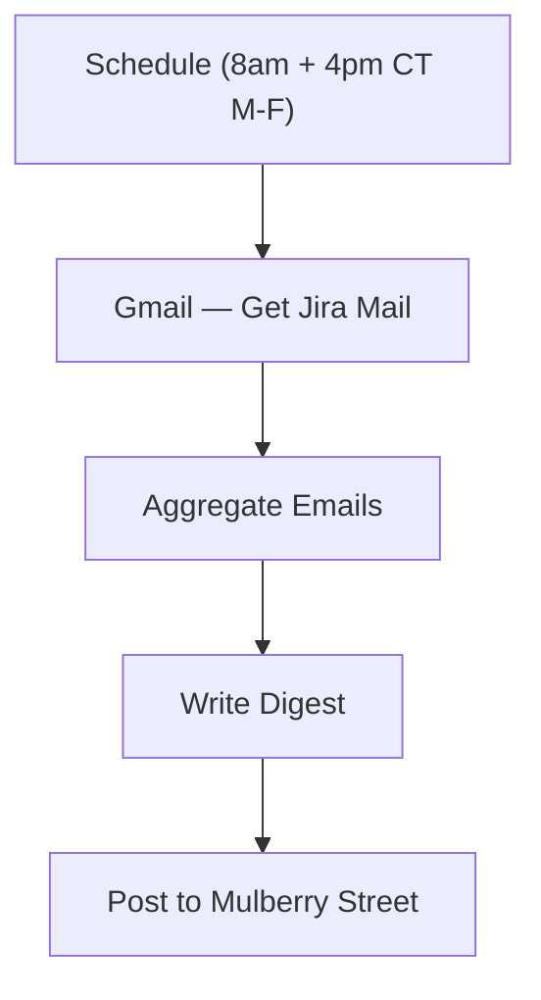

# Jira digest

`agent/n8n/workflows/bugsy-jira-digest.json` — twice-a-day digest of Jira notification mail from `jira@ultrasoundai.atlassian.net`, posted to `#mulberry-street` (channel id `C0AV83XUSTU`) with summary + action items and every ticket key linkified to the UltrasoundAI workspace.

## Schedule

Cron `0 8,16 * * 1-5` in `America/Chicago` — **8:00 AM and 4:00 PM CT, Mon–Fri**. No state in Postgres; each run queries `newer_than:1d` so there's intentional overlap between runs (the LLM is told to dedupe).

## Pipeline



- **Gmail — Get Jira Mail** uses Gmail search `from:jira@ultrasoundai.atlassian.net newer_than:1d`. `alwaysOutputData: true` so the downstream chain runs even on empty inboxes.
- **Aggregate Emails** strips HTML, truncates each body to 1200 chars, and folds all messages into one big text block with `--- Email N ---` separators. Outputs `{ count, emails }`. Returns `(no Jira mail in the window)` when the inbox is empty so the LLM can produce a quiet-shift one-liner.
- **Write Digest** is a single-shot LLM call against `claude-sonnet-4-6` via LiteLLM. System prompt enforces persona (sparing, max two flourishes), output structure (`*Summary*` + `*Action Items*`), and the strict link-format rule for ticket IDs.
- **Post to Mulberry Street** sends the result to channel `C0AV83XUSTU` with `unfurl_links: false` and `unfurl_media: false` so the linkified ticket IDs don't blow up the message with Atlassian previews.

## Output format

Two sections in Slack mrkdwn:

```
*Summary*
<2-5 short paragraphs, grouped by ticket where useful>

*Action Items*
• <one bullet per action, ticket IDs as <https://ultrasoundai.atlassian.net/browse/UTT-123|UTT-123>>
```

Empty-inbox runs collapse to a single in-voice line.

## Why `<URL|TEXT>` for ticket IDs

Slack mrkdwn link syntax is `<URL|display>`. When display text is supplied (not just a bare URL), Slack typically suppresses link previews on its own — and the node also sets `unfurl_links` + `unfurl_media` to `false` belt-and-suspenders. A message with 15 tickets stays a single tight digest instead of a tower of unfurled cards.

## Credentials required

| Slot | Credential | Notes |
|---|---|---|
| Gmail | `Gmail - Bitmotive (anthony@bitmotive.com)` | OAuth2, work account. **You must add this credential in n8n before activating.** |
| LiteLLM | `LiteLLM - local proxy` | Already in n8n — same one every other workflow uses. |
| Slack | `Slack - Bugsy` | Already in n8n. |

After importing the workflow, open the `Gmail — Get Jira Mail` node and bind the Bitmotive credential (the JSON ships a placeholder `id`). Then activate.

## Tuning

- **Cadence too sparse?** Change cron to `0 8,12,16 * * 1-5` (3x/day) or `0 8-18/2 * * 1-5` (every 2h in business hours).
- **Different project key?** Sender filter is workspace-scoped (`jira@<workspace>.atlassian.net`) so it auto-includes every project you receive mail for. The Jira URL pattern in the system prompt is hardcoded to `ultrasoundai.atlassian.net` — edit there if you need a different host.
- **Too noisy?** Tighten the Gmail filter, e.g. `from:jira@ultrasoundai.atlassian.net AND -subject:"watching"` to drop "you are now watching" emails.
- **Want richer action items?** Bump model to `claude-opus-4-7` (slower, smarter) or feed more body bytes — raise the 1200-char truncate in `Aggregate Emails`.

## See also

- [Inbox Watcher](bugsy-inbox-watcher.md) — per-email triage on the personal Gmail (different pattern, currently inactive)

<!-- NODE-REF:START:bugsy-jira-digest — auto-generated by agent/n8n/scripts/generate-workflow-reference.mjs; do not edit by hand -->

## Node reference: Bugsy — Jira Digest (work email)

> Auto-generated from `agent/n8n/workflows/bugsy-jira-digest.json` on 2026-05-12. Run `node agent/n8n/scripts/generate-workflow-reference.mjs` to refresh.

**Active:** `false` · **Nodes:** 5 · **Execution order:** `v1`

### Flow



### Nodes

#### Schedule (8am + 4pm CT M-F)
*Type:* `n8n-nodes-base.scheduleTrigger`

- **Schedule:** cron `0 8,16 * * 1-5`
- **Timezone:** `America/Chicago`

#### Gmail — Get Jira Mail
*Type:* `n8n-nodes-base.gmail`

- **Resource:** `message`
- **Operation:** `getAll`

- **Credential (gmailOAuth2):** `Gmail - Bitmotive (anthony@bitmotive.com)`

#### Aggregate Emails
*Type:* `n8n-nodes-base.code`

```javascript
const emails = $('Gmail — Get Jira Mail').all();

// Strip HTML so the LLM gets clean text instead of markup
const stripHtml = (s) => String(s || '')
  .replace(/<style[\s\S]*?<\/style>/gi, ' ')
  .replace(/<script[\s\S]*?<\/script>/gi, ' ')
  .replace(/<[^>]+>/g, ' ')
  .replace(/&nbsp;/g, ' ')
  .replace(/&amp;/g, '&')
  .replace(/&lt;/g, '<')
  .replace(/&gt;/g, '>')
  .replace(/\s+/g, ' ')
  .trim();

if (!emails.length || (emails.length === 1 && !emails[0].json?.id)) {
  return [{ json: { count: 0, emails: '(no Jira mail in the window)' } }];
}

const lines = emails.map((it, i) => {
  const j = it.json || {};
  const from = (j.from && j.from.text) ? j.from.text : (j.from || j.From || '?');
  const subject = j.subject || j.Subject || '?';
  const snippet = j.snippet || '';
  const body = stripHtml(j.text || j.html || '').substring(0, 1200);
  return `--- Email ${i + 1} ---\nFrom: ${from}\nSubject: ${subject}\nSnippet: ${snippet}\nBody: ${body}`;
}).join('\n\n');

return [{ json: { count: emails.length, emails: lines } }];
```

#### Write Digest
*Type:* `@n8n/n8n-nodes-langchain.openAi`

- **Model:** `claude-sonnet-4-6`
- **Temperature:** `0.5`

**SYSTEM message:**
```text
You are Bugsy, the boss's right-hand. Voice: 1970s NY Italian-American mobster — confident, warm, direct with the classic new yorker accent. Use voice flourishes (capisce, boss, skip, hey! ho!) SPARINGLY — at MOST two across the whole digest, ideally in the opener and closer. Underneath the voice the content must be CORRECT, ACCURATE, and PROFESSIONAL.

You're reading a digest of Jira notification emails from ultrasoundai.atlassian.net (subject prefix '[JIRA]', project key UTT). Produce ONE Slack message in Slack mrkdwn with two sections:

*Summary*
What's moved on the project since the last digest. Group activity by ticket where it makes sense. Call out: blockers, status changes, priority shifts, deadlines, who's waiting on whom. Just a few short paragraphs. Condensed, succinct; not chatty.

*Action Items*
Concrete things the boss has to DO. One bullet per item starting with •. Cover:
- tickets newly assigned to him
- @mentions calling him out
- review or approval requests
- status changes that need a response from him
- threads where someone is waiting on his input
- work that obviously needs a ticket but doesn't have one — suggest creating, label '(no ticket yet)'

FORMATTING RULES — strict:
- EVERY ticket ID (UTT-NNN) must be a hyperlink in this exact form: <https://ultrasoundai.atlassian.net/browse/UTT-NNN|UTT-NNN>. No bare 'UTT-123' anywhere.
- Slack markdown only: *bold*, _italic_, `code`, bullets with •.
- No markdown headers (no `#`), no tables.
- No closing signature.
- Keep it tight. If something's repeated across emails (same comment quoted back), mention once.

If the input is '(no Jira mail in the window)': respond with a one-liner in voice, e.g. 'Quiet shift, boss — nothin' worth ya time on the Jira front.'

Output the message body ONLY — no preamble, no 'Here is your digest:'.
```

**USER message:**
```text
={{ $json.emails }}
```

- **Credential (openAiApi):** `LiteLLM - local proxy`

#### Post to Mulberry Street
*Type:* `n8n-nodes-base.slack`

- **Resource:** `message`
- **Operation:** `post`
- **Channel:** `mulberry-street (C0AV83XUSTU)`

**Text:**
```text
={{ $json.message.content }}
```

- **Credential (slackApi):** `Slack - Bugsy`

<!-- NODE-REF:END:bugsy-jira-digest -->
