# Bugsy — Daily Lead Hunter (/leads)

`agent/n8n/workflows/bugsy-leads-hunter.json`.

_Add a hand-written summary of what this workflow does and why._

<!-- NODE-REF:START:bugsy-leads-hunter — auto-generated by agent/n8n/scripts/generate-workflow-reference.mjs; do not edit by hand -->

## Node reference: Bugsy — Daily Lead Hunter (/leads)

> Auto-generated from `agent/n8n/workflows/bugsy-leads-hunter.json` on 2026-05-11. Run `node agent/n8n/scripts/generate-workflow-reference.mjs` to refresh.

**Active:** `false` · **Nodes:** 21 · **Execution order:** `v1`

### Flow

```mermaid
flowchart TD
  schedule_trigger["Schedule Trigger"]
  searxng_q1_greenhouse_high_comp_eng["SearXNG Q1 — Greenhouse High-Comp Eng"]
  searxng_q2_lever_high_comp_eng["SearXNG Q2 — Lever High-Comp Eng"]
  searxng_q3_ashby_high_comp_eng["SearXNG Q3 — Ashby High-Comp Eng"]
  searxng_q4_techcrunch_funding["SearXNG Q4 — TechCrunch Funding"]
  searxng_q5_wire_service_funding["SearXNG Q5 — Wire Service Funding"]
  searxng_q6_hn_who_s_hiring["SearXNG Q6 — HN Who's Hiring"]
  searxng_q7_greenhouse_tech_debt_signal["SearXNG Q7 — Greenhouse Tech Debt Signal"]
  searxng_q8_lever_ai_tech_debt_signal["SearXNG Q8 — Lever AI + Tech Debt Signal"]
  searxng_q9_wellfound_startups["SearXNG Q9 — Wellfound Startups"]
  searxng_q10_builtin_austin["SearXNG Q10 — BuiltIn Austin"]
  searxng_q11_greenhouse_premature_ml_hire["SearXNG Q11 — Greenhouse Premature ML Hire"]
  searxng_q12_weworkremotely_stack_match["SearXNG Q12 — WeWorkRemotely Stack Match"]
  merge_deduplicate["Merge + Deduplicate"]
  score_prospects["Score Prospects"]
  parse_scores["Parse Scores"]
  filter_4_top_5["Filter ≥4 + Top 5"]
  prepare_upsert_sql["Prepare Upsert SQL"]
  upsert_to_postgres["Upsert to Postgres"]
  format_slack_message["Format Slack Message"]
  send_to_mulberry_street["Send to Mulberry Street"]
  schedule_trigger --> searxng_q1_greenhouse_high_comp_eng
  searxng_q1_greenhouse_high_comp_eng --> searxng_q2_lever_high_comp_eng
  searxng_q2_lever_high_comp_eng --> searxng_q3_ashby_high_comp_eng
  searxng_q3_ashby_high_comp_eng --> searxng_q4_techcrunch_funding
  searxng_q4_techcrunch_funding --> searxng_q5_wire_service_funding
  searxng_q5_wire_service_funding --> searxng_q6_hn_who_s_hiring
  searxng_q6_hn_who_s_hiring --> searxng_q7_greenhouse_tech_debt_signal
  searxng_q7_greenhouse_tech_debt_signal --> searxng_q8_lever_ai_tech_debt_signal
  searxng_q8_lever_ai_tech_debt_signal --> searxng_q9_wellfound_startups
  searxng_q9_wellfound_startups --> searxng_q10_builtin_austin
  searxng_q10_builtin_austin --> searxng_q11_greenhouse_premature_ml_hire
  searxng_q11_greenhouse_premature_ml_hire --> searxng_q12_weworkremotely_stack_match
  searxng_q12_weworkremotely_stack_match --> merge_deduplicate
  merge_deduplicate --> score_prospects
  score_prospects --> parse_scores
  parse_scores --> filter_4_top_5
  filter_4_top_5 --> prepare_upsert_sql
  prepare_upsert_sql --> upsert_to_postgres
  upsert_to_postgres --> format_slack_message
  format_slack_message --> send_to_mulberry_street
```



### Nodes

#### Schedule Trigger
*Type:* `n8n-nodes-base.scheduleTrigger`

- **Schedule:** cron `0 6 * * 1-5`
- **Timezone:** `America/Chicago`

#### SearXNG Q1 — Greenhouse High-Comp Eng
*Type:* `n8n-nodes-base.httpRequest`

- **Method:** `GET`
- **URL:** `http://searxng:8080/search`
- **Timeout:** 15000ms

#### SearXNG Q2 — Lever High-Comp Eng
*Type:* `n8n-nodes-base.httpRequest`

- **Method:** `GET`
- **URL:** `http://searxng:8080/search`
- **Timeout:** 15000ms

#### SearXNG Q3 — Ashby High-Comp Eng
*Type:* `n8n-nodes-base.httpRequest`

- **Method:** `GET`
- **URL:** `http://searxng:8080/search`
- **Timeout:** 15000ms

#### SearXNG Q4 — TechCrunch Funding
*Type:* `n8n-nodes-base.httpRequest`

- **Method:** `GET`
- **URL:** `http://searxng:8080/search`
- **Timeout:** 15000ms

#### SearXNG Q5 — Wire Service Funding
*Type:* `n8n-nodes-base.httpRequest`

- **Method:** `GET`
- **URL:** `http://searxng:8080/search`
- **Timeout:** 15000ms

#### SearXNG Q6 — HN Who's Hiring
*Type:* `n8n-nodes-base.httpRequest`

- **Method:** `GET`
- **URL:** `http://searxng:8080/search`
- **Timeout:** 15000ms

#### SearXNG Q7 — Greenhouse Tech Debt Signal
*Type:* `n8n-nodes-base.httpRequest`

- **Method:** `GET`
- **URL:** `http://searxng:8080/search`
- **Timeout:** 15000ms

#### SearXNG Q8 — Lever AI + Tech Debt Signal
*Type:* `n8n-nodes-base.httpRequest`

- **Method:** `GET`
- **URL:** `http://searxng:8080/search`
- **Timeout:** 15000ms

#### SearXNG Q9 — Wellfound Startups
*Type:* `n8n-nodes-base.httpRequest`

- **Method:** `GET`
- **URL:** `http://searxng:8080/search`
- **Timeout:** 15000ms

#### SearXNG Q10 — BuiltIn Austin
*Type:* `n8n-nodes-base.httpRequest`

- **Method:** `GET`
- **URL:** `http://searxng:8080/search`
- **Timeout:** 15000ms

#### SearXNG Q11 — Greenhouse Premature ML Hire
*Type:* `n8n-nodes-base.httpRequest`

- **Method:** `GET`
- **URL:** `http://searxng:8080/search`
- **Timeout:** 15000ms

#### SearXNG Q12 — WeWorkRemotely Stack Match
*Type:* `n8n-nodes-base.httpRequest`

- **Method:** `GET`
- **URL:** `http://searxng:8080/search`
- **Timeout:** 15000ms

#### Merge + Deduplicate
*Type:* `n8n-nodes-base.code`

```javascript
// All 12 SearXNG nodes ran sequentially — all outputs available by name.
const allResults = [
  ...($('SearXNG Q1 — Greenhouse High-Comp Eng').first().json.results || []),
  ...($('SearXNG Q2 — Lever High-Comp Eng').first().json.results || []),
  ...($('SearXNG Q3 — Ashby High-Comp Eng').first().json.results || []),
  ...($('SearXNG Q4 — TechCrunch Funding').first().json.results || []),
  ...($('SearXNG Q5 — Wire Service Funding').first().json.results || []),
  ...($('SearXNG Q6 — HN Who\'s Hiring').first().json.results || []),
  ...($('SearXNG Q7 — Greenhouse Tech Debt Signal').first().json.results || []),
  ...($('SearXNG Q8 — Lever AI + Tech Debt Signal').first().json.results || []),
  ...($('SearXNG Q9 — Wellfound Startups').first().json.results || []),
  ...($('SearXNG Q10 — BuiltIn Austin').first().json.results || []),
  ...($('SearXNG Q11 — Greenhouse Premature ML Hire').first().json.results || []),
  ...($('SearXNG Q12 — WeWorkRemotely Stack Match').first().json.results || [])
];

// For ATS job boards, dedupe by company slug in the path — not the hostname.
// Otherwise every Greenhouse/Lever/Ashby posting collapses to one result.
const ATS_HOSTS = [
  'boards.greenhouse.io',
  'job-boards.greenhouse.io',
  'jobs.lever.co',
  'jobs.ashbyhq.com'
];

function dedupeKey(url) {
  const hostMatch = url.match(/^https?:\/\/(?:www\.)?([^\/]+)(\/.*)?$/);
  if (!hostMatch) return null;
  const host = hostMatch[1];
  const path = hostMatch[2] || '';
  const segments = path.split('/').filter(Boolean);
  if (ATS_HOSTS.includes(host) && segments.length >= 1) {
    // Use host + company slug so each company is unique across the board
    return host + '/' + segments[0];
  }
  return host;
}

const seen = new Set();
const unique = [];

for (const r of allResults) {
  if (!r.url) continue;
  const key = dedupeKey(r.url);
  if (!key) continue;
  if (seen.has(key)) continue;
  seen.add(key);

  const hostMatch = r.url.match(/^https?:\/\/(?:www\.)?([^\/]+)/);
  const domain = hostMatch ? hostMatch[1] : key;

  unique.push({
    company: r.title
      ? r.title.split('|')[0].split(' - ')[0].split(' – ')[0].trim()
      : domain,
    url: r.url,
    domain,
    title: r.title || '',
    snippet: (r.content || '').replace(/\s+/g, ' ').trim().substring(0, 300)
  });

  if (unique.length >= 50) break;
}

return [{ json: { prospects: unique } }];
```

#### Score Prospects
*Type:* `@n8n/n8n-nodes-langchain.openAi`

- **Model:** `gemini-2.5-flash`
- **Temperature:** `0.2`

**USER message:**
```text
You are Bugsy's scoring engine — a cold, analytical unit that scores prospects against Anthony Coffey's BD profile buying signals. No prose, no personality, only valid JSON output.

=================================================================
COFFEY.CODES BD PROFILE — source of truth for scoring
=================================================================

# Mission
Anthony Coffey runs coffey.codes — a senior solo developer / AI implementer who ships production-grade work for SMBs and growing tech orgs. Maker first, hands-on the keyboard, NOT an advisor or strategist-for-hire.

# Pricing (anchor numbers)
- Project work: $5k+ minimum, most $5k–$50k
- Part-time retainer: $1,500/week (~2 days/wk)
- Full-time retainer: $2,500/week (embedded senior engineer)

# ICPs (canonical, in priority order)
1. ICP1 — Established SMEs (20–200 emp): SaaS, professional services, e-commerce, non-profits. Buyers: CTO, VP Eng, Head of Product, founder. Need: custom builds, modernization, reliable long-term partner.
2. ICP2 — Forward-thinking businesses (50–500 emp): tech, finance, healthcare, logistics, MarTech. Buyers: CTO, CIO, Head of Innovation, Director of Data Science. Need: practical AI integration, data engineering for AI.
3. ICP3 — SMBs needing real web presence: local services, professional firms, growing brands. Buyers: owner, marketing lead. Need: modern site that converts, analytics baked in.
4. ICP4 — Startups / agencies / tech teams needing senior IC capacity: any industry. Need: experienced hands on keyboard, lead dev who ships without ramp. NOT a fractional CTO role.

# Anti-ICP (score 1–3, never pursue)
- Sub-$5k budgets / consumer apps / crypto-Web3
- Heavily regulated (defense, HIPAA, SOC2 finance)
- Companies seeking Fractional CTO / strategic advisor only
- Just hired a senior in-house engineer or CTO
- 'Move fast and break things' culture
- Pure ML research / academic AI
- Anyone seeking 'cheap' or 'offshore-equivalent' rates
- White-label cheap dev work agencies
- Public layoffs in last 90 days (budget gone)
- Funded Series C+ with >$10M ARR (want full agencies)
- All-in on Salesforce/SAP/.NET stacks

# Buying signals to score against (13 total)
## Strong signals (each adds 1.5 to base score)
1. Hiring senior backend/full-stack engineers with $140k+ comp
2. Recently raised seed or Series A in target industries (SaaS, fintech, healthtech)
3. Job postings mentioning 'tech debt', 'modernization', 'rebuild', 'platform overhaul'
4. Mentions of LLM, GenAI, 'AI initiative', 'AI strategy' in careers/press/blog
5. Hiring 'AI engineer' but company is tiny (<30 ppl) — consulting fits better
## Medium signals (each adds 0.75)
6. Open GitHub issues stale 30+ days on Node/Python/React/TS repos
7. Tech stack matches Anthony's (Node, Python, React, TypeScript)
8. CTO/founder publicly posting about scaling pain or hiring difficulty
9. Recent product launch + visibly broken/slow site
10. Job posting open >60 days for senior eng role (can't find the FTE)
11. Acquisition or merger announcement
12. Conference talks/podcasts mentioning matching stack
## Geographic boost (+0.5 to score)
13. Austin-based company

# Scoring guide
- Start at a base of 3.0
- Add signal weights above, cap at 10
- Apply anti-ICP: if ANY anti-ICP condition is met, cap score at 3 regardless
- Round to nearest integer

=================================================================
YOUR TASK
=================================================================

You will receive a JSON array of prospect objects. For each prospect, score it 1–10 against the BD profile signals based on the url, title, and snippet provided. Infer as much as possible from the data given.

Output a JSON array — one entry per prospect — matching this schema exactly:

[
  {
    "company": "company name",
    "url": "original url",
    "domain": "domain without www",
    "score": <integer 1-10>,
    "icpCategory": "ICP1" | "ICP2" | "ICP3" | "ICP4" | "Anti-ICP",
    "signals": ["short label of each signal matched"],
    "reason": "one sentence explaining score in plain language"
  }
]

Rules:
- Output ONLY the JSON array. No markdown code fences, no commentary.
- If snippet/title provide insufficient data, score conservatively (4–5) and say so in reason.
- Never hallucinate signals not inferable from the provided data.
- Anti-ICP hits ALWAYS cap score at 3.
```

**USER message:**
```text
=Prospects to score (JSON array):
={{ JSON.stringify($json.prospects, null, 2) }}

Score each one now. Return only the JSON array.
```

- **Credential (openAiApi):** `LiteLLM - local proxy`

#### Parse Scores
*Type:* `n8n-nodes-base.code`

````javascript
const raw = $input.first().json.message.content;
const cleaned = raw
  .replace(/^```(?:json)?\s*/i, '')
  .replace(/\s*```\s*$/i, '')
  .trim();

let scored;
try {
  scored = JSON.parse(cleaned);
} catch (err) {
  return [{ json: {
    parseError: err.message,
    rawOutput: raw,
    scored: []
  }}];
}

return [{ json: { scored } }];
````

#### Filter ≥4 + Top 5
*Type:* `n8n-nodes-base.code`

```javascript
const scored = $input.first().json.scored || [];

const topLeads = scored
  .filter(function(p) { return p.score >= 4; })
  .sort(function(a, b) { return b.score - a.score; })
  .slice(0, 5);

return [{ json: { topLeads } }];
```

#### Prepare Upsert SQL
*Type:* `n8n-nodes-base.code`

```javascript
const topLeads = $input.first().json.topLeads || [];

if (topLeads.length === 0) {
  return [{ json: { sql: 'SELECT 1', topLeads } }];
}

function esc(v) {
  return String(v || '').replace(/'/g, "''");
}

const rows = topLeads.map(function(l) {
  return (
    `('${esc(l.domain)}', '${esc(l.company)}', '${esc(l.url)}',` +
    ` '${esc(l.icpCategory)}', ${parseInt(l.score, 10) || 0},` +
    ` '${esc(JSON.stringify(l.signals || []))}'::jsonb,` +
    ` 'new', 'daily-hunter')`
  );
});

const sql = [
  'INSERT INTO leads (domain, company, url, icp_bucket, score, signals, status, source)',
  'VALUES',
  rows.join(',\n'),
  'ON CONFLICT (domain) DO UPDATE SET',
  '  score        = EXCLUDED.score,',
  '  icp_bucket   = EXCLUDED.icp_bucket,',
  '  signals      = EXCLUDED.signals,',
  '  last_touched = now()',
  "WHERE leads.status = 'new'"
].join('\n');

return [{ json: { sql, topLeads } }];
```

#### Upsert to Postgres
*Type:* `n8n-nodes-base.postgres`

- **Operation:** `executeQuery`

**Query:**
```sql
={{ $json.sql }}
```

- **Credential (postgres):** `Postgres — agent DB`

#### Format Slack Message
*Type:* `n8n-nodes-base.code`

```javascript
const topLeads = $('Prepare Upsert SQL').first().json.topLeads || [];

if (topLeads.length === 0) {
  return [{ json: {
    slackText: "🕵️ *Morning Numbers — nothin' hit the bar today, skip.* Back at it tomorrow."
  }}];
}

const date = new Date().toLocaleDateString('en-US', { weekday: 'short', month: 'short', day: 'numeric' });

const lines = topLeads.map(function(lead) {
  const signals = (lead.signals || []).slice(0, 3).join(' · ');
  return [
    `🔥 *${lead.score}/10* · *${lead.company}* · ${lead.icpCategory} · <${lead.url}|view posting>`,
    `_${lead.reason}_`,
    `${signals}`,
    `/research <${lead.url}|${lead.domain}>`
  ].join('\n');
});

const header = `*🗂 Morning Numbers — ${date}* · top ${topLeads.length} from the boards\n${'─'.repeat(40)}`;

return [{ json: { slackText: [header, ...lines].join('\n\n') } }];
```

#### Send to Mulberry Street
*Type:* `n8n-nodes-base.slack`

- **Resource:** `message`
- **Operation:** `post`
- **Channel:** `[object Object]`

**Text:**
```text
={{ $json.slackText }}
```

- **Credential (slackApi):** `Slack - Bugsy`

<!-- NODE-REF:END:bugsy-leads-hunter -->
