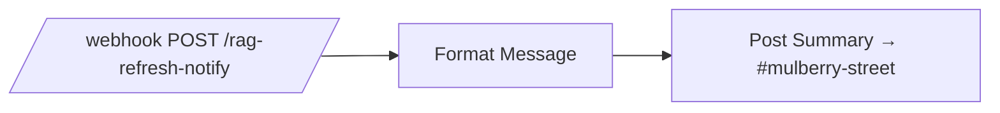
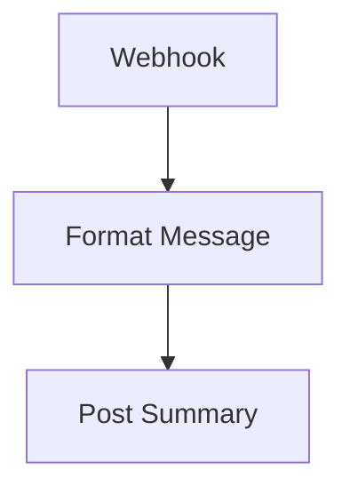

# Bugsy — RAG Refresh Notify

`agent/n8n/workflows/bugsy-rag-refresh-notify.json` — a small notification shim that turns a JSON status payload from the host-side `rag-refresh.sh` cron job into a one-line Slack post in `#mulberry-street`.

This workflow is paired with [`agent/scripts/rag-refresh.sh`](../../agent/scripts/rag-refresh.sh) — the script does all the work (git-pull every source repo, re-run the RAG ingest), then `curl`s here with the result. The workflow itself is intentionally dumb: no business logic, just formatting + posting.

See [Daily RAG source-repo refresh](../operations/rag-refresh.md) for the full operational picture (cron install, verification, troubleshooting) and [SPEC-RAG-001](../specs/active/SPEC-RAG-001-daily-source-repo-refresh.md) for the design + decision record.

## Pipeline



## Payload contract

The script POSTs:

```json
{
  "summary": "pulled:2 up-to-date:1 failed:0 failed_repos:[periscope]",
  "log_path": "/home/agent/agent/logs/rag-refresh/2026-05-18T04-00-00.log",
  "ts": "2026-05-18T09:00:00Z"
}
```

`failed_repos` is only present when at least one pull failed. `log_path` is always set.

## Output format

The Format Message node parses `failed:N` out of the summary and branches:

- **N = 0:** `:white_check_mark: *rag-refresh*\n\`pulled:2 up-to-date:1 failed:0\` _at 2026-05-18T09:00:00Z_`
- **N > 0:** `:warning: *rag-refresh* — needs a look\n\`pulled:1 up-to-date:1 failed:1 failed_repos:[periscope]\` _at ..._\nlog: \`/home/agent/agent/logs/rag-refresh/...log\``

Log path only appears on failure, since success runs are cheap and the per-run log file is easy to find anyway.

## Failure mode

The webhook fires-and-forgets (default `responseMode`) — the script's curl is `-s` and ignored on non-2xx, so if this workflow is inactive or n8n is down, the cron job still does its work and writes the local log. No silent data loss; you just miss the Slack ping for that morning.

If the workflow is active but the Slack node fails (channel doesn't exist, credential revoked), the n8n execution log captures the error.

## Credentials

| Slot | Credential |
|---|---|
| Slack | `Slack - Bugsy` (same credential used by every other Slack-posting workflow) |


<!-- NODE-REF:START:bugsy-rag-refresh-notify — auto-generated by agent/n8n/scripts/generate-workflow-reference.mjs; do not edit by hand -->

## Node reference: Bugsy — RAG Refresh Notify

> Auto-generated from `agent/n8n/workflows/bugsy-rag-refresh-notify.json` on 2026-05-18. Run `node agent/n8n/scripts/generate-workflow-reference.mjs` to refresh.

**Active:** `false` · **Nodes:** 3 · **Execution order:** `v1`

### Flow



### Nodes

#### Webhook
*Type:* `n8n-nodes-base.webhook`

- **Method:** `POST`
- **Path:** `/rag-refresh-notify`

#### Format Message
*Type:* `n8n-nodes-base.code`

```javascript
// Receive the JSON payload posted by ~/agent/scripts/rag-refresh.sh and
// build a one-line Slack mrkdwn summary. The payload shape:
//   { summary: 'pulled:2 up-to-date:1 failed:0 failed_repos:[periscope]',
//     log_path: '/home/agent/agent/logs/rag-refresh/...log',
//     ts: '2026-05-18T09:00:00Z' }
// On success the summary is one terse line. On failure (failed>0) we add
// the log path so the boss can SSH and tail it without guessing the filename.
const raw = $input.first().json;
const body = raw.body || raw;
const summary = body.summary || '(no summary)';
const logPath = body.log_path || '';
const ts = body.ts || new Date().toISOString();

// Parse `failed:N` out of the summary so we know whether to escalate the tone.
const failedMatch = summary.match(/failed:(\d+)/);
const failedCount = failedMatch ? parseInt(failedMatch[1], 10) : 0;
const hadFailures = failedCount > 0;

const marker = hadFailures ? ':warning:' : ':white_check_mark:';
const label = hadFailures ? '*rag-refresh* — needs a look' : '*rag-refresh*';
const tail = hadFailures && logPath ? `\nlog: \`${logPath}\`` : '';

const text = `${marker} ${label}\n\`${summary}\` _at ${ts}_${tail}`;

return [{ json: { text } }];
```

#### Post Summary
*Type:* `n8n-nodes-base.slack`

- **Resource:** `message`
- **Operation:** `post`
- **Channel:** `mulberry-street (C0AV83XUSTU)`

**Text:**
```text
={{ $json.text }}
```

- **Credential (slackApi):** `Slack - Bugsy`

<!-- NODE-REF:END:bugsy-rag-refresh-notify -->
