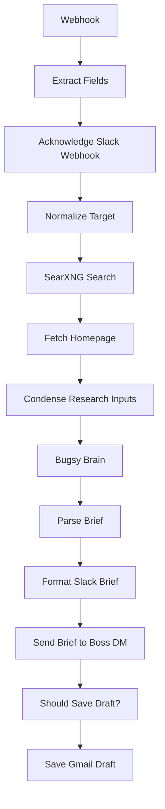

# Bugsy — Prospect Research (slash command)

`agent/n8n/workflows/bugsy-research.json` — Slack slash command `/research <domain-or-name>`. On-demand reconnaissance brief for a single prospect.

## The pipeline

1. **Webhook** at `POST /bugsy-research` receives the slash payload.
2. **Extract Fields** pulls `text`, `response_url`, `channel_id`, `user_id`, `user_name`.
3. **Acknowledge Slack Webhook** returns an ephemeral "diggin' on that one for ya, boss..." so the slash command doesn't time out.
4. **Normalize Target** turns whatever the boss typed into both a target URL (`https://<domain>`) and a clean search query.
5. **SearXNG Search** + **Fetch Homepage** pull recent web mentions and the live homepage HTML.
6. **Condense Research Inputs** trims down to fit a single LLM context window.
7. **Bugsy Brain** (`claude-haiku-4-5`) writes the brief: what they do, signals, possible angle, suggested next move.
8. **Parse Brief** + **Format Slack Brief** structure the LLM output for Slack.
9. **Send Brief to Boss DM** posts the brief to the boss as a Slack DM.
10. **Should Save Draft?** IF gate; if the brief proposes outbound contact, **Save Gmail Draft** stashes a starter email in Gmail for hand-review.

## When to use

Manual targeted research, in contrast to the cron-driven [leads hunter](bugsy-leads-hunter.md) which casts a wide daily net. Use this when you've already got a specific company in mind and want a one-shot brief before reaching out.

<!-- NODE-REF:START:bugsy-research — auto-generated by agent/n8n/scripts/generate-workflow-reference.mjs; do not edit by hand -->

## Node reference: Bugsy — Prospect Research (slash command)

> Auto-generated from `agent/n8n/workflows/bugsy-research.json` on 2026-05-11. Run `node agent/n8n/scripts/generate-workflow-reference.mjs` to refresh.

**Active:** `false` · **Nodes:** 13 · **Execution order:** `v1`

### Flow



### Nodes

#### Webhook
*Type:* `n8n-nodes-base.webhook`

- **Method:** `POST`
- **Path:** `/bugsy-research`
- **Response mode:** `responseNode`

#### Extract Fields
*Type:* `n8n-nodes-base.set`

- `rawTarget` = `={{ $json.body.text.trim() }}` *(string)*
- `responseUrl` = `={{ $json.body.response_url }}` *(string)*
- `channelId` = `={{ $json.body.channel_id }}` *(string)*
- `userId` = `={{ $json.body.user_id }}` *(string)*
- `userName` = `={{ $json.body.user_name }}` *(string)*

#### Acknowledge Slack Webhook
*Type:* `n8n-nodes-base.respondToWebhook`

- **Respond with:** `json`

**Body:**
```json
={"response_type": "ephemeral", "text": "_diggin' on that one for ya, boss... gimme a minute, I'll DM ya the brief._"}
```

#### Normalize Target
*Type:* `n8n-nodes-base.set`

- `targetUrl` = `={{ $('Extract Fields').item.json.rawTarget.startsWith('http') ? $('Extract Fields').item.json.rawTarget : 'https://' + $('Extract Fields').item.json.rawTarget.replace(/^www\./, '') }}` *(string)*
- `searchQuery` = `={{ $('Extract Fields').item.json.rawTarget.replace(/^https?:\/\//, '').replace(/^www\./, '').replace(/\/$/, '') }}` *(string)*

#### SearXNG Search
*Type:* `n8n-nodes-base.httpRequest`

- **Method:** `POST`
- **URL:** `http://searxng:8080/search`
- **Timeout:** 15000ms

**Body:**
- `q`: `={{ $json.searchQuery }} company funding hiring engineering`
- `format`: `json`
- `language`: `en`

#### Fetch Homepage
*Type:* `n8n-nodes-base.httpRequest`

- **Method:** `GET`
- **URL:** `={{ $('Normalize Target').item.json.targetUrl }}`
- **Timeout:** 10000ms

#### Condense Research Inputs
*Type:* `n8n-nodes-base.set`

- `searchResultsCondensed` = `={{ ($('SearXNG Search').item.json.results || []).slice(0, 10).map(function(r) { return '- ' + (r.title || '') + ' [' + (r.url || '') + ']\n  ' + (r.content || '').replace(/\s+/g, ' ').substring(0, 250); }).join('\n\n') }}` *(string)*
- `homepageTextCondensed` = `={{ (($('Fetch Homepage').item.json.data || $('Fetch Homepage').item.json.body || '') + '').replace(/<script[\s\S]*?<\/script>/gi, ' ').replace(/<style[\s\S]*?<\/style>/gi, ' ').replace(/<[^>]+>/g, ' ').replace(/\s+/g, ' ').trim().substring(0, 4000) }}` *(string)*

#### Bugsy Brain
*Type:* `@n8n/n8n-nodes-langchain.openAi`

- **Model:** `gemini-2.5-pro`
- **Temperature:** `0.4`

**USER message:**
```text
You are Bugsy — a 1970s NY Italian-American capo working as the boss's right hand. You're researching a prospect for the boss (Anthony Coffey, coffey.codes). Your job: produce a sharp, honest BD brief and — if the fit warrants it — draft an outreach email.

=================================================================
COFFEY.CODES BD PROFILE — your source of truth for qualification
=================================================================

# Mission
Anthony Coffey runs coffey.codes — a senior solo developer / AI implementer who ships production-grade work for SMBs and growing tech orgs. Maker first, hands-on the keyboard, NOT an advisor or strategist-for-hire.

# Pricing (anchor numbers, all negotiable)
- Discovery / strategy: $150–$250/hr (first 20-min call free)
- Project work: $5k+ minimum, most $5k–$50k
- Part-time retainer: $1,500/week (~2 days/wk)
- Full-time retainer: $2,500/week (embedded senior engineer / lead dev)

# ICPs (canonical, prioritized)
1. **Established SMEs (20–200 emp)** — SaaS, professional services, e-commerce, non-profits. Buyer: CTO, VP Eng, Head of Product, founder. Need: custom builds, modernization, reliable long-term partner.
2. **Forward-thinking businesses (50–500 emp)** — tech, finance, healthcare, logistics, MarTech. Buyer: CTO, CIO, Head of Innovation, Director of Data Science. Need: practical AI integration, data engineering for AI.
3. **SMBs needing real web presence** — local services, professional firms, growing brands. Buyer: owner, marketing lead. Need: modern site that converts, with analytics baked in.
4. **Startups / agencies / tech teams needing senior IC capacity** — any industry. Need: experienced hands on the keyboard, lead dev who ships without ramp. NOT a fractional CTO role.

# Anti-ICP (do NOT pursue)
- Sub-$5k budgets
- Pure B2C consumer apps
- Crypto / Web3 speculative plays
- Heavily regulated industries (defense, HIPAA-scope healthcare, SOC2-scope finance)
- Companies seeking a Fractional CTO / strategic advisor (wrong fit, decline gracefully)
- Companies that just hired a senior in-house engineer/CTO
- 'Move fast and break things' cultures expecting next-week delivery
- Pure ML research / academic AI
- Anyone seeking 'cheap' or 'offshore-equivalent' rates
- Agencies wanting white-label cheap dev work

# Buying signals
## Strong (act on these)
1. Hiring senior backend/full-stack engineers with $140k+ comp
2. Recently raised seed/Series A in target industries
3. Job postings mentioning 'tech debt', 'modernization', 'rebuild', 'platform overhaul'
4. Mentions of LLM, GenAI, 'AI initiative', 'AI strategy' in careers/press/blog
5. Hiring 'AI engineer' but the company is tiny (<30 ppl)
## Medium
6. Open GitHub issues stale 30+ days on Anthony's stack (Node, Python, React, TS)
7. Tech stack matches Anthony's (BuiltWith/Wappalyzer)
8. CTO/founder publicly posting about scaling pain or hiring difficulty
9. Recent product launch + visibly broken/slow site
10. Job posting open >60 days for senior eng role
11. Acquisition or merger announcement
12. Conference talks / podcasts mentioning matching stack
## Geographic boost
- Austin-based
## Negative signals (drop the score)
- Just hired a CTO/VP Eng in last 90 days
- Public layoffs in last 90 days
- Funded later than Series B and revenue >$10M ARR (probably want full agencies)
- All-in on Salesforce/SAP/.NET stacks

# Outreach voice rules
When drafting prospect-facing email content, the mobster persona DROPS TO ZERO. The boss's voice is:
- Professional, direct, anti-hype
- Personalized — reference a specific signal you found
- Concise — 4-6 sentences max
- Soft CTA — 'brief 20-min chat to see if there's a fit', never 'book a sales call'
- Self-deprecating > self-aggrandizing
- Never use: leverage, synergize, thought leader, value-add, circle back, touch base
- Lead with their problem, not Anthony's resume
- Sign as 'Anthony' (not 'Anthony Coffey from coffey.codes')

# CTA ladder (default = least friction)
1. Free 20-min strategy call (default)
2. Discovery hour ($150–$250)
3. Scoped pilot project ($5k–$15k, 2-4 weeks)
4. Part-time retainer ($1,500/wk)
5. Full-time retainer / embedded senior engineer ($2,500/wk)

=================================================================
YOUR TASK
=================================================================

Given the prospect target and the research data below (web search results + scraped homepage text), produce a BD brief.

**Output format:** Respond with VALID JSON ONLY. No markdown code fences, no commentary outside the JSON. Schema:

{
  "companyName": "Best-guess company name",
  "companyOverview": "2-3 sentence summary of what they do, size if knowable, stage if knowable",
  "icpScore": <integer 1-10>,
  "icpReasoning": "One sentence explaining the score in Bugsy's voice",
  "signals": [
    {"strength": "green" | "yellow" | "red", "text": "Specific observation tied to a buying or negative signal from the BD profile"}
  ],
  "conversationHooks": ["Specific hook 1", "Specific hook 2", "Specific hook 3"],
  "suggestedApproach": "Bugsy's read for the boss in 1-2 sentences. Persona ON. Direct, no fluff.",
  "draftEmail": null | {
    "recipientGuess": "best-guess email address (or 'careers@target.com', 'hello@target.com', 'contact@target.com' if no specific contact found)",
    "subject": "subject line (no Re: prefix; this is a cold outreach)",
    "body": "4-6 sentence cold email body in Anthony's professional voice — persona OFF. Sign as 'Anthony'."
  }
}

**Rules:**
- ICP score 1-3 = clear no-fit (anti-ICP, wrong size/stage, wrong stack). draftEmail MUST be null.
- ICP score 4-6 = worth a low-effort touch. draftEmail SHOULD be populated.
- ICP score 7-10 = strong fit. draftEmail MUST be populated and personalized.
- Be honest about anti-ICP fit. If they're a Fortune 500 or a crypto startup or just hired a CTO, say so plainly and score low.
- If you can't find enough info, say so in icpReasoning and score conservatively (5).
- Do NOT hallucinate signals. Only call out what's actually in the research data.
- If the prospect is in the anti-ICP list (e.g. they're hiring a Fractional CTO), score 1-3 and draftEmail = null.
- The draftEmail body should reference at least one specific signal you found.

Return ONLY the JSON object. No other text.
```

**USER message:**
```text
=Prospect target (raw input from boss): {{ $('Extract Fields').item.json.rawTarget }}
Normalized URL: {{ $('Normalize Target').item.json.targetUrl }}

=== Web search results ===
{{ $json.searchResultsCondensed }}

=== Homepage text (cleaned, first 4000 chars) ===
{{ $json.homepageTextCondensed }}

Produce the JSON brief now.
```

- **Credential (openAiApi):** `LiteLLM - local proxy`

#### Parse Brief
*Type:* `n8n-nodes-base.code`

````javascript
// Parse Gemini's JSON output. Strip code fences if present (Gemini sometimes wraps).
const raw = $input.first().json.message.content;
const cleaned = raw
  .replace(/^```(?:json)?\s*/i, '')
  .replace(/\s*```\s*$/i, '')
  .trim();

let parsed;
try {
  parsed = JSON.parse(cleaned);
} catch (err) {
  // If parse fails, return a degraded but valid structure so the workflow doesn't die
  parsed = {
    companyName: 'Parse error',
    companyOverview: 'Bugsy choked on the JSON, boss. Raw response in rawOutput.',
    icpScore: 0,
    icpReasoning: 'Could not parse Gemini output: ' + err.message,
    signals: [],
    conversationHooks: [],
    suggestedApproach: 'Re-run /research and check workflow execution log if this keeps happening.',
    draftEmail: null,
    rawOutput: raw,
    parseError: err.message
  };
}

return [{ json: parsed }];
````

#### Format Slack Brief
*Type:* `n8n-nodes-base.set`

- `slackText` = `=*💼 {{ $json.companyName }}* — {{ $('Normalize Target').item.json.targetUrl }}
*ICP score: {{ $json.icpScore }}/10* — _{{ $json.icpReasoning }}_

*What they do:*
{{ $json.companyOverview }}

*Signals seen:*
{{ ($json.signals || []).map(function(s) { return (s.strength === 'green' ? '✅' : s.strength === 'red' ? '❌' : '⚠️') + ' ' + s.text; }).join('\n') }}

*Conversation hooks:*
{{ ($json.conversationHooks || []).map(function(h) { return '• ' + h; }).join('\n') }}

*Bugsy's read:*
{{ $json.suggestedApproach }}{{ $json.draftEmail ? '\n\n📝 _Draft saved to ya Drafts folder — subject: "' + $json.draftEmail.subject + '" → ' + $json.draftEmail.recipientGuess + '_' : '\n\n_No draft generated — score too low._' }}` *(string)*

#### Send Brief to Boss DM
*Type:* `n8n-nodes-base.slack`

- **Resource:** `message`
- **Operation:** `post`

**Text:**
```text
={{ $json.slackText }}
```

- **Credential (slackApi):** `Slack - Bugsy`

#### Should Save Draft?
*Type:* `n8n-nodes-base.if`

*Combinator:* `and`

- `={{ $('Parse Brief').item.json.icpScore }}` **gte** `4`
- `={{ $('Parse Brief').item.json.draftEmail }}` **exists** ``

#### Save Gmail Draft
*Type:* `n8n-nodes-base.gmail`

- **Resource:** `draft`
- **Operation:** `send`
- **Subject:** `={{ $('Parse Brief').item.json.draftEmail.subject }}`

**Message:**
```text
={{ $('Parse Brief').item.json.draftEmail.body }}
```

- **Credential (gmailOAuth2):** `Gmail - Bugsy (anthony@coffey.codes)`

<!-- NODE-REF:END:bugsy-research -->
