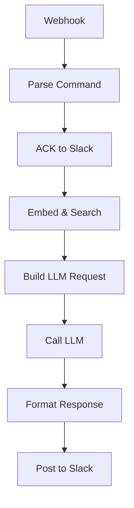

# Bugsy — Slack RAG

`agent/n8n/workflows/bugsy-slack-rag.json` — **legacy** Slack slash command at `POST /slack-rag`. Stateless RAG-grounded chat.

Predecessor to the [unified workflow](bugsy-unified.md). Same shape as `bugsy-chat` but with a RAG retrieval step before the LLM call (no memory). Kept around as a fallback if the unified workflow regresses on retrieval quality — the slash command path is the same one the unified workflow exposes under `/ask`, so the user-facing UX is similar.

## When this matters

Day-to-day: pick whichever surface is active in n8n.

If you're debugging RAG quality and want to isolate the retrieval layer from chat memory, this workflow's strict one-shot pipeline (`embed → search → LLM → respond`) is cleaner to reason about than the unified flow.

<!-- NODE-REF:START:bugsy-slack-rag — auto-generated by agent/n8n/scripts/generate-workflow-reference.mjs; do not edit by hand -->

## Node reference: Bugsy — Slack RAG

> Auto-generated from `agent/n8n/workflows/bugsy-slack-rag.json` on 2026-05-11. Run `node agent/n8n/scripts/generate-workflow-reference.mjs` to refresh.

**Active:** `false` · **Nodes:** 8 · **Execution order:** `v1`

### Flow



### Nodes

#### Webhook
*Type:* `n8n-nodes-base.webhook`

- **Method:** `POST`
- **Path:** `/slack-rag`
- **Response mode:** `responseNode`

#### Parse Command
*Type:* `n8n-nodes-base.code`

```javascript
const raw = $input.first().json;
const body = raw.body || raw;
const question = (body.text || '').trim();
const responseUrl = body.response_url || '';
const userName = body.user_name || 'boss';
return [{ json: { question, responseUrl, userName, empty: !question } }];
```

#### ACK to Slack
*Type:* `n8n-nodes-base.respondToWebhook`

- **Respond with:** `text`

**Body:**
```text
={{
  $('Parse Command').first().json.empty
    ? 'What\'s the question, boss? Try: /bugsy what are my strongest skills?'
    : 'On it, boss...'
}}
```

#### Embed & Search
*Type:* `n8n-nodes-base.code`

```javascript
const axios = require('axios');
const { question, responseUrl } = $('Parse Command').first().json;

if (!question) return [];

const embedRes = await axios.post('http://ollama:11434/api/embeddings', {
  model: 'nomic-embed-text',
  prompt: question
});

const searchRes = await axios.post('http://qdrant:6333/collections/personal_knowledge/points/search', {
  vector: embedRes.data.embedding,
  limit: 15,
  with_payload: true
});

const chunks = searchRes.data.result.map(r => ({
  text: r.payload.text,
  title: r.payload.title,
  category: r.payload.category,
  score: Math.round(r.score * 100) / 100
}));

return [{ json: { question, responseUrl, chunks } }];
```

#### Build LLM Request
*Type:* `n8n-nodes-base.code`

```javascript
const { question, responseUrl, chunks } = $input.first().json;

const context = chunks.length
  ? chunks.map((c, i) => '[' + (i+1) + '] ' + c.title + '\n' + c.text).join('\n\n')
  : 'No relevant context found in knowledge base.';

const systemPrompt = 'You are Bugsy, a sharp 1970s New York Italian fixer who also happens to be a highly capable AI assistant. Call the user "boss." Lead with useful, accurate information drawn from the context — the persona is flavor, not filler. Keep answers tight and grounded. Slack formatting only — no markdown headers, use *bold* and _italic_ if needed. If the context is insufficient, say so straight.\n\nCONTEXT FROM BOSS\'S KNOWLEDGE BASE:\n' + context;

const sources = [...new Set(chunks.map(c => c.title))];

return [{
  json: {
    payload: {
      model: 'claude-haiku-4-5',
      messages: [
        { role: 'system', content: systemPrompt },
        { role: 'user', content: question }
      ]
    },
    sources,
    responseUrl
  }
}];
```

#### Call LLM
*Type:* `n8n-nodes-base.httpRequest`

- **Method:** `POST`
- **URL:** `http://litellm:4000/v1/chat/completions`
- **Auth:** `genericCredentialType` (httpHeaderAuth)
- **Timeout:** 60000ms

**Headers:**
- `Content-Type`: `application/json`

**Body:**
```json
={{ JSON.stringify($json.payload) }}
```

- **Credential (httpHeaderAuth):** `LiteLLM Bearer`

#### Format Response
*Type:* `n8n-nodes-base.code`

```javascript
const llm = $input.first().json;
const { sources, responseUrl } = $('Build LLM Request').first().json;
const answer = llm.choices && llm.choices[0] && llm.choices[0].message && llm.choices[0].message.content
  ? llm.choices[0].message.content
  : 'Boss, somethin\'s off — the LLM came back empty.';
return [{ json: { answer, sources, responseUrl } }];
```

#### Post to Slack
*Type:* `n8n-nodes-base.code`

```javascript
const axios = require('axios');
const { answer, sources, responseUrl } = $input.first().json;

if (!responseUrl) return [{ json: { ok: false } }];

const footer = sources && sources.length ? '\n\n_Sources: ' + sources.join(', ') + '_' : '';

await axios.post(responseUrl, {
  response_type: 'in_channel',
  text: answer + footer
});

return [{ json: { ok: true } }];
```

<!-- NODE-REF:END:bugsy-slack-rag -->
