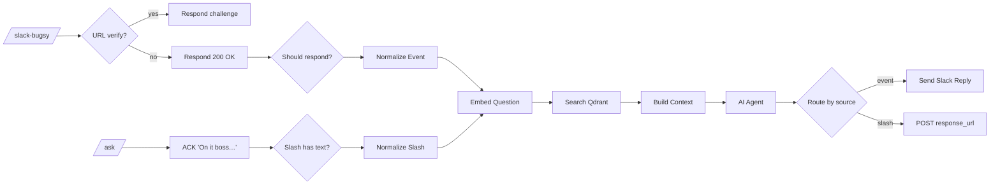

# Bugsy (unified)

`agent/n8n/workflows/bugsy.json` — single workflow that handles every Bugsy-as-assistant surface.

## Surfaces

- Slack DMs — webhook `/slack-bugsy` (Slack Event API)
- Slack @mentions — same webhook
- `/ask` slash command — webhook `/ask`

All three reach the same AI Agent with the same memory store and the same RAG pipeline. Only the entry parser and the reply transport differ.

## Pipeline



## Memory keys

Sessions are scoped per surface so contexts don't bleed:

| Surface | sessionKey |
|---|---|
| DM | `slack:dm:{user_id}` |
| Mention thread | `slack:thread:{channel_id}:{thread_ts}` |
| Slash | `slack:slash:{user_id}` |

Memory uses Postgres Chat Memory (`@n8n/n8n-nodes-langchain.memoryPostgresChat`) with a context window of 10 messages.

## RAG injection

Pre-retrieval, not tool-based. Build Context bakes the retrieved chunks into the `chatInput` field itself:

```
=== KNOWLEDGE BASE ===
[1] Anthony Coffey Resume
...resume chunk text...
=== END KNOWLEDGE BASE ===

=== SPEAKER ===
Name: anthony
Slack mention: <@U0AUSKT2VRD>
=== END SPEAKER ===

=== USER QUESTION ===
tell me about my expertise
```

This is the bulletproof path because the langchain agent's `systemMessage` field doesn't reliably evaluate `$json` or `$('NodeName')` expressions in this n8n version — putting dynamic content in `chatInput` guarantees the LLM sees it.

The system prompt is purely static persona + an instruction explaining the structured sections.

## Predecessors (retired)

This workflow replaces three earlier ones:

| Old | What it did |
|---|---|
| `bugsy-events.json` | Slack DMs/mentions, memory, no RAG |
| `bugsy-chat.json` | Slash command, memory, no RAG |
| `bugsy-slack-rag.json` | Slash command, RAG, no memory |

Keep them archived for reference but deactivate before activating this one (webhook path conflicts).

## See also

- [RAG Ingest](rag-ingest.md) — how knowledge gets into Qdrant
- [RAG Query](rag-query.md) — programmatic RAG endpoint (testing/scripts)
