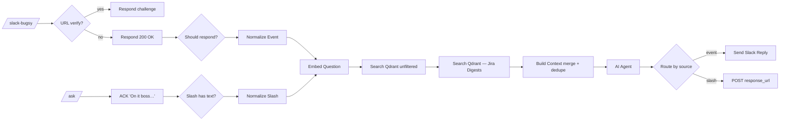
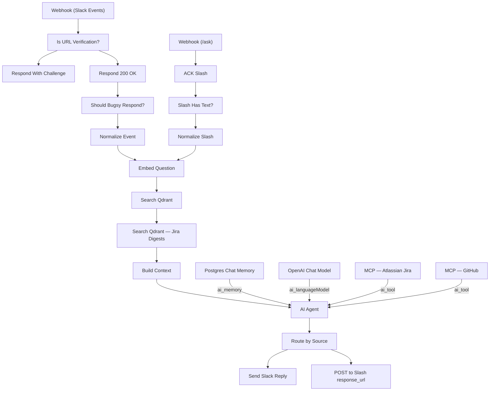

# Bugsy (unified)

`agent/n8n/workflows/bugsy.json` — single workflow intended to handle every Bugsy-as-assistant Slack surface in one place.

## Surfaces

- Slack DMs — webhook `/slack-bugsy` (Slack Event API)
- Slack @mentions — same webhook
- `/ask` slash command — webhook `/ask`

All three reach the same AI Agent with the same memory store and the same RAG pipeline. Only the entry parser and the reply transport differ.

## Pipeline



## Memory keys

Sessions are scoped per surface so contexts don't bleed:

| Surface | sessionKey |
|---|---|
| DM | `slack:dm:{user_id}` |
| Mention thread | `slack:thread:{channel_id}:{thread_ts}` |
| Slash | `slack:slash:{user_id}` |

Memory uses Postgres Chat Memory (`@n8n/n8n-nodes-langchain.memoryPostgresChat`) with a context window of 10 messages.

## RAG injection

Pre-retrieval, not tool-based. Build Context bakes the retrieved chunks into the `chatInput` field itself:

```
=== KNOWLEDGE BASE — pre-retrieved relevant context ===
May include the boss's personal info ..., Jira digest history, ... whatever embed-matched the question. USE the relevant parts directly. Cite specifics ...

[1] Anthony Coffey Resume (bio)
...resume chunk text...

[2] Jira Digest 2026-05-14T... (jira-digests)
...digest chunk text...
=== END KNOWLEDGE BASE ===

=== SPEAKER ===
Name: anthony
Slack mention: <@U0AUSKT2VRD>
=== END SPEAKER ===

=== USER QUESTION ===
tell me about my expertise
```

This is the bulletproof path because the langchain agent's `systemMessage` field doesn't reliably evaluate `$json` or `$('NodeName')` expressions in this n8n version — putting dynamic content in `chatInput` guarantees the LLM sees it.

The system prompt is purely static persona + an instruction explaining the structured sections.

### Two-stage retrieval (added 2026-05-17 — [BUG-AGENT-001](../specs/active/BUG-AGENT-001-bugsy-retrieves-only-one-jira-digest.md))

Retrieval runs two Qdrant searches sequentially against the same embedded question:

1. **`Search Qdrant`** — unfiltered, `limit: 10`. Picks the best chunks across all categories.
2. **`Search Qdrant — Jira Digests`** — category-filtered to `jira-digests`, `limit: 10`. Guarantees Jira-archive chunks make it into context even when bigger / longer chunks from other categories would otherwise outrank them.

**`Build Context`** merges both result sets, dedupes by Qdrant point ID (keeping the higher-scoring hit on collision), sorts by score, and renders each entry as `[N] title (category)` so the LLM can see the source type alongside the title. Max ~20 chunks in context after dedup.

**Why sequential vs parallel-with-merge:** sequential adds ~50ms latency (one extra Qdrant round-trip) which is invisible against the multi-second LLM call. It avoids the n8n quirk where a Merge node is needed to gate downstream nodes when fan-out branches are independent. Build Context reads from both upstream nodes by name (`$('Search Qdrant')` and `$('Search Qdrant — Jira Digests')`) regardless of which is the direct ancestor.

**Generalization candidate:** if other categories (projects, articles) also get crowded out, we can add a category-filtered search per under-represented category. Today only `jira-digests` has this treatment.

## See also

- [RAG Ingest](rag-ingest.md) — how knowledge gets into Qdrant
- [RAG Query](rag-query.md) — programmatic RAG endpoint (testing/scripts)

<!-- NODE-REF:START:bugsy — auto-generated by agent/n8n/scripts/generate-workflow-reference.mjs; do not edit by hand -->

## Node reference: Bugsy

> Auto-generated from `agent/n8n/workflows/bugsy.json` on 2026-05-19. Run `node agent/n8n/scripts/generate-workflow-reference.mjs` to refresh.

**Active:** `false` · **Nodes:** 22 · **Execution order:** `v1`

### Flow



### Nodes

#### Webhook (Slack Events)
*Type:* `n8n-nodes-base.webhook`

- **Method:** `POST`
- **Path:** `/slack-bugsy`
- **Response mode:** `responseNode`

#### Is URL Verification?
*Type:* `n8n-nodes-base.if`

*Combinator:* `and`

- `={{ $json.body.type }}` **equals** `url_verification`

#### Respond With Challenge
*Type:* `n8n-nodes-base.respondToWebhook`

- **Respond with:** `json`

**Body:**
```json
={"challenge": "{{ $json.body.challenge }}"}
```

#### Respond 200 OK
*Type:* `n8n-nodes-base.respondToWebhook`

- **Respond with:** `noData`

#### Should Bugsy Respond?
*Type:* `n8n-nodes-base.if`

*Combinator:* `and`

- `={{ $json.body.event.bot_id }}` **empty** ``
- `={{ $json.body.event.text }}` **notEmpty** ``

#### Normalize Event
*Type:* `n8n-nodes-base.set`

- `chatInput` = `={{ $json.body.event.text.replace(/<@[A-Z0-9]+>\s*/g, '').trim() }}` *(string)*
- `source` = `event` *(string)*
- `userId` = `={{ $json.body.event.user }}` *(string)*
- `userName` = `={{ $json.body.event.user_name || '' }}` *(string)*
- `channel` = `={{ $json.body.event.channel }}` *(string)*
- `threadTs` = `={{ $json.body.event.thread_ts || $json.body.event.ts }}` *(string)*
- `sessionKey` = `={{ $json.body.event.channel_type === 'im' ? 'slack:dm:' + $json.body.event.user : 'slack:thread:' + $json.body.event.channel + ':' + ($json.body.event.thread_ts || $json.body.event.ts) }}` *(string)*

#### Webhook (/ask)
*Type:* `n8n-nodes-base.webhook`

- **Method:** `POST`
- **Path:** `/ask`
- **Response mode:** `responseNode`

#### ACK Slash
*Type:* `n8n-nodes-base.respondToWebhook`

- **Respond with:** `text`

**Body:**
```text
={{ ($json.body.text || '').trim() ? 'On it, boss...' : 'What\'s the question, boss? Try: /ask what are my strongest skills?' }}
```

#### Slash Has Text?
*Type:* `n8n-nodes-base.if`

*Combinator:* `and`

- `={{ ($json.body.text || '').trim() }}` **notEmpty** ``

#### Normalize Slash
*Type:* `n8n-nodes-base.set`

- `chatInput` = `={{ ($json.body.text || '').trim() }}` *(string)*
- `source` = `slash` *(string)*
- `userId` = `={{ $json.body.user_id }}` *(string)*
- `userName` = `={{ $json.body.user_name || '' }}` *(string)*
- `channel` = `={{ $json.body.channel_id || '' }}` *(string)*
- `threadTs` = `` *(string)*
- `responseUrl` = `={{ $json.body.response_url }}` *(string)*
- `sessionKey` = `=slack:slash:{{ $json.body.user_id }}` *(string)*

#### Embed Question
*Type:* `n8n-nodes-base.httpRequest`

- **Method:** `POST`
- **URL:** `http://ollama:11434/api/embeddings`
- **Timeout:** 30000ms

**Body:**
- `model`: `nomic-embed-text`
- `prompt`: `={{ $json.chatInput }}`

#### Search Qdrant
*Type:* `n8n-nodes-base.httpRequest`

- **Method:** `POST`
- **URL:** `http://qdrant:6333/collections/personal_knowledge/points/search`
- **Timeout:** 30000ms

**Body:**
```json
={{ JSON.stringify({ vector: $json.embedding, limit: 10, with_payload: true }) }}
```

#### Search Qdrant — Jira Digests
*Type:* `n8n-nodes-base.httpRequest`

- **Method:** `POST`
- **URL:** `http://qdrant:6333/collections/personal_knowledge/points/search`
- **Timeout:** 30000ms

**Body:**
```json
={{ JSON.stringify({ vector: $('Embed Question').first().json.embedding, limit: 10, with_payload: true, filter: { must: [ { key: 'category', match: { value: 'jira-digests' } } ] } }) }}
```

#### Build Context
*Type:* `n8n-nodes-base.code`

```javascript
// Pull from both retrieval branches: unfiltered top-N + jira-digests-filtered top-N.
// Dedupe by Qdrant point id; on collision keep the higher-scoring hit.
// Sort by score so the strongest matches lead the context block.
const general = $('Search Qdrant').first().json || {};
const jira = $('Search Qdrant — Jira Digests').first().json || {};

const projectHit = (r) => ({
  id: r.id,
  text: r.payload.text,
  title: r.payload.title,
  category: r.payload.category,
  score: r.score,
});

const raw = [
  ...(general.result || []).map(projectHit),
  ...(jira.result || []).map(projectHit),
];

const byId = new Map();
for (const h of raw) {
  const existing = byId.get(h.id);
  if (!existing || h.score > existing.score) byId.set(h.id, h);
}

const hits = [...byId.values()]
  .sort((a, b) => b.score - a.score)
  .map(h => ({ ...h, score: Math.round(h.score * 100) / 100 }));

// Whichever Normalize node didn't run will throw on access, so try each.
let src = {};
try { src = $('Normalize Event').first().json; } catch (e) {}
if (!src || !src.chatInput) {
  try { src = $('Normalize Slash').first().json; } catch (e) {}
}
src = src || {};

const contextBlock = hits.length
  ? hits.map((c, i) => '[' + (i+1) + '] ' + c.title + ' (' + c.category + ')\n' + c.text).join('\n\n')
  : '(none)';

const sources = [...new Set(hits.map(h => h.title))];
const userQ = src.chatInput || '';
const userName = src.userName || 'boss';
const userId = src.userId || '';

// Inject context + speaker info into chatInput itself so the agent
// definitely receives it. Expressions in the agent's systemMessage
// field don't reliably resolve (some versions ignore them), so this
// is the bulletproof path.
const augmented = [
  '=== KNOWLEDGE BASE — pre-retrieved relevant context ===',
  'May include the boss\'s personal info (resume, projects, writing), Jira digest history, or other indexed material — whatever embed-matched the question. USE the relevant parts directly. Cite specifics (digest dates, ticket IDs, project names). If the question seems broader than the content shown, acknowledge partial coverage — never claim the archive doesn\'t exist when there\'s content here.',
  '',
  contextBlock,
  '',
  '=== END KNOWLEDGE BASE ===',
  '',
  '=== SPEAKER ===',
  'Name: ' + userName,
  'Slack mention: ' + (userId ? '<@' + userId + '>' : '(unknown)'),
  '=== END SPEAKER ===',
  '',
  '=== USER QUESTION ===',
  userQ
].join('\n');

return [{
  json: {
    chatInput: augmented,
    originalQuestion: userQ,
    sessionKey: src.sessionKey || '',
    source: src.source || '',
    userId,
    userName,
    channel: src.channel || '',
    threadTs: src.threadTs || '',
    responseUrl: src.responseUrl || '',
    sources
  }
}];
```

#### AI Agent
*Type:* `@n8n/n8n-nodes-langchain.agent`

**System message:**
```text
You are Bugsy — the boss's right hand. 1970s New York Italian-American, connected to the life (cosa nostra). Cool, smooth, knows everybody. Sharp humor with a hint of menace. You call the user 'boss' or 'skip', etc. or any other endearing term that a mafia capo would use toward their Don.

Rules:
- Keep responses SHORT for Slack (1-3 sentences usually).
- ONE OR TWO voice flourishes per message MAX — 'capisce', 'ya', dropped g's ('nothin'', 'talkin''), 'lemme tell ya', 'between you and me'. Do NOT make every word an accent. The persona is seasoning, not the meal.
- Direct, action-oriented. No filler.
- If asked to draft an email: output JUST the email body, professional tone matching the recipient. The persona drops to ZERO in email content.
- If asked to do something you can't actually do (send email, query inbox, run code, etc.): say so plainly. Example: 'Can't reach into your inbox just yet, boss. We'll get there.'
- NEVER fake capability. Don't claim to have done something you didn't.
- A little dry humor is on-brand; cartoony goofiness is not. Bugsy ain't nobody's clown, capiche?

The USER MESSAGE you receive will be wrapped with structured sections:
- KNOWLEDGE BASE: pre-retrieved relevant context (may include personal info, Jira digest history, project notes — whatever embed-matched the question). Each entry is labeled with its category in parentheses, e.g. (jira-digests), (bio), (projects). Use whatever's relevant. If the section says '(none)', proceed without it. If it has content but the question is broader than what's shown (e.g. 'all of May's Jira digests' but only two appear), acknowledge the partial coverage from the archive rather than claiming the archive doesn't exist. Example: 'Got two May digests on file, boss — the 14th and the 21st. Want me to walk through 'em?'
- SPEAKER: who's talking to you (use their name/mention naturally).
- USER QUESTION: what they actually asked. Answer this.

Answer ONLY the USER QUESTION. Do not echo or quote the structured sections back. Use them silently as grounding.

TOOLS — you have live tools attached and should use them when the question wants CURRENT state, not historical context:
- atlassian (Jira read-only): for anything about specific Jira tickets (UTT-NNN), current status, recent activity, sprint state, assignments, comments, watchers. The KNOWLEDGE BASE 'jira-digests' entries are point-in-time snapshots from past digests — they go stale within hours. If the boss asks 'what's UTT-299's status?' or 'who's working on the dropdown thing this week?', call the atlassian tool to look up live state; do NOT answer from a digest. When you call the tool, briefly tell the boss what you found ('Just checked Jira: UTT-299's still In Review, B.J.'s waiting on ya.'). All Jira surfaces are READ-ONLY for now — don't try to transition, comment, or assign tickets; if asked, say writes aren't wired up yet.
- github (read-only): for anything about the boss's repos — pull requests, issues, file contents, recent commits, code search, repo metadata. Use it when the boss asks 'what PRs are open on coffey.codes?', 'what's that issue about the menu bug?', 'show me the latest commit to periscope', 'who's reviewing my open PRs?', etc. The boss's primary repos include anthonycoffey/coffey.codes, anthonycoffey/_agent (this stack), and anthonycoffey/periscope. When you call the tool, briefly cite what you pulled ('Pulled GitHub: #42 on coffey.codes is open, waiting on review since Friday.'). READ-ONLY — don't try to open PRs, comment on issues, or push commits; say writes aren't wired up yet.

If a tool call fails or returns nothing useful, fall back to whatever's in KNOWLEDGE BASE (noting it's possibly stale) and tell the boss the tool didn't answer.
```

#### Postgres Chat Memory
*Type:* `@n8n/n8n-nodes-langchain.memoryPostgresChat`

- **Session key:** `={{ $json.sessionKey }}`
- **Context window:** `10`

- **Credential (postgres):** `Postgres - Memory database`

#### OpenAI Chat Model
*Type:* `@n8n/n8n-nodes-langchain.lmChatOpenAi`

- **Model:** `claude-sonnet-4-6`

- **Credential (openAiApi):** `LiteLLM - local proxy`

#### MCP — Atlassian Jira
*Type:* `@n8n/n8n-nodes-langchain.mcpClientTool`

```json
{
  "endpointUrl": "http://mcp-atlassian:9000/sse",
  "serverTransport": "sse",
  "authentication": "none",
  "include": "all",
  "options": {}
}
```

#### MCP — GitHub
*Type:* `@n8n/n8n-nodes-langchain.mcpClientTool`

```json
{
  "endpointUrl": "http://mcp-github:8082/readonly",
  "serverTransport": "httpStreamable",
  "authentication": "none",
  "include": "all",
  "options": {}
}
```

#### Route by Source
*Type:* `n8n-nodes-base.if`

*Combinator:* `and`

- `={{ $('Build Context').first().json.source }}` **equals** `event`

#### Send Slack Reply
*Type:* `n8n-nodes-base.slack`

- **Resource:** `message`
- **Operation:** `post`
- **Channel:** `={{ $('Build Context').first().json.channel }}`

**Text:**
```text
={{ $json.output }}
```

- **Credential (slackApi):** `Slack - Bugsy`

#### POST to Slash response_url
*Type:* `n8n-nodes-base.httpRequest`

- **Method:** `POST`
- **URL:** `={{ $('Build Context').first().json.responseUrl }}`
- **Timeout:** 15000ms

**Body:**
```json
={{ JSON.stringify({ response_type: 'in_channel', text: $json.output + ($('Build Context').first().json.sources.length ? '\n\n_Sources: ' + $('Build Context').first().json.sources.join(', ') + '_' : '') }) }}
```

<!-- NODE-REF:END:bugsy -->
