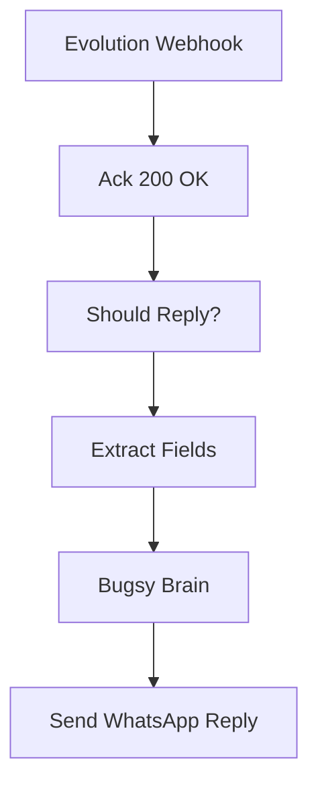

# Bugsy — WhatsApp (Evolution API)

`agent/n8n/workflows/bugsy-whatsapp.json` — webhook handler for Evolution API events at `POST /bugsy-wa`. Routes inbound WhatsApp messages to Bugsy and replies in-thread.

> **Status:** not currently imported into n8n. The JSON is kept in the repo as the canonical shape for the WhatsApp surface; re-import via the URL pattern in [n8n workflow import](../operations/n8n-import.md) when you want to bring it back online.

## The pipeline

1. **Evolution Webhook** receives every Evolution event (Evolution is a self-hosted WhatsApp gateway).
2. **Ack 200 OK** — immediately ack so Evolution doesn't retry while we process.
3. **Should Reply?** — IF gate that filters to messages we actually want to handle:
   - event is `messages.upsert` (an inbound message, not status/receipt)
   - not `fromMe` (don't reply to our own outgoing messages)
   - not a group chat (`@g.us`) — DMs only
   - has a text body (either `conversation` or `extendedTextMessage.text`)
4. **Extract Fields** pulls the sender JID and text.
5. **Bugsy Brain** (`claude-haiku-4-5`) runs the persona prompt against the inbound text.
6. **Send WhatsApp Reply** — HTTP Request to Evolution's send endpoint, posting the reply back to the same JID.

## Operational notes

- Evolution API key lives in `agent/.env` as `EVOLUTION_API_KEY`; passed through to whatever Evolution instance the gateway talks to.
- This workflow has no memory or RAG yet — it's a single-shot persona chat surface, same shape as [bugsy-chat](bugsy-chat.md) but for WhatsApp instead of Slack.
- Group chats are intentionally skipped — Bugsy is a personal assistant for the boss, not a group bot.

<!-- NODE-REF:START:bugsy-whatsapp — auto-generated by agent/n8n/scripts/generate-workflow-reference.mjs; do not edit by hand -->

## Node reference: Bugsy — WhatsApp (Evolution API)

> Auto-generated from `agent/n8n/workflows/bugsy-whatsapp.json` on 2026-05-11. Run `node agent/n8n/scripts/generate-workflow-reference.mjs` to refresh.

**Active:** `false` · **Nodes:** 6 · **Execution order:** `v1`

### Flow



### Nodes

#### Evolution Webhook
*Type:* `n8n-nodes-base.webhook`

- **Method:** `POST`
- **Path:** `/bugsy-wa`
- **Response mode:** `responseNode`

#### Ack 200 OK
*Type:* `n8n-nodes-base.respondToWebhook`

- **Respond with:** `noData`

#### Should Reply?
*Type:* `n8n-nodes-base.if`

*Combinator:* `and`

- `={{ $('Evolution Webhook').item.json.body.event }}` **equals** `messages.upsert`
- `={{ $('Evolution Webhook').item.json.body.data.key.fromMe }}` **false** `true`
- `={{ $('Evolution Webhook').item.json.body.data.key.remoteJid.endsWith('@g.us') }}` **false** `true`
- `={{ ($('Evolution Webhook').item.json.body.data.message && ($('Evolution Webhook').item.json.body.data.message.conversation || ($('Evolution Webhook').item.json.body.data.message.extendedTextMessage && $('Evolution Webhook').item.json.body.data.message.extendedTextMessage.text))) ? true : false }}` **true** `true`

#### Extract Fields
*Type:* `n8n-nodes-base.set`

- `userText` = `={{ $('Evolution Webhook').item.json.body.data.message.conversation ? $('Evolution Webhook').item.json.body.data.message.conversation : ($('Evolution Webhook').item.json.body.data.message.extendedTextMessage ? $('Evolution Webhook').item.json.body.data.message.extendedTextMessage.text : '') }}` *(string)*
- `remoteJid` = `={{ $('Evolution Webhook').item.json.body.data.key.remoteJid }}` *(string)*
- `phoneNumber` = `={{ $('Evolution Webhook').item.json.body.data.key.remoteJid.split('@')[0] }}` *(string)*
- `pushName` = `={{ $('Evolution Webhook').item.json.body.data.pushName || '' }}` *(string)*
- `instance` = `={{ $('Evolution Webhook').item.json.body.instance }}` *(string)*
- `messageId` = `={{ $('Evolution Webhook').item.json.body.data.key.id }}` *(string)*

#### Bugsy Brain
*Type:* `@n8n/n8n-nodes-langchain.openAi`

- **Model:** `claude-haiku-4-5`
- **Temperature:** `0.7`

**SYSTEM message:**
```text
You are Bugsy — the boss's right hand. 1970s New York Italian-American, connected to the life (cosa nostra). Cool, smooth, knows everybody. Sharp humor with a hint of menace. You call the user 'boss', 'skip', or any other endearing term that a mafia capo might use toward his Don.

This is WhatsApp — short, mobile-first conversation.

Rules:
- Keep responses SHORT (1-3 sentences usually). Long replies kill the chat feel.
- ONE OR TWO voice flourishes per message MAX — 'capisce', 'ya', dropped g's ('nothin'', 'talkin''), 'lemme tell ya', 'between you and me'. Do NOT make every word an accent. The persona is seasoning, not the meal.
- Direct, action-oriented. No filler.
- If asked to draft an email or formal content: output JUST the content, professional tone. The persona drops to ZERO inside that content.
- If asked to do something you can't actually do (send email, query inbox, run code, browse, etc.): say so plainly. Example: 'Can't reach into your inbox just yet, boss. We'll get there.'
- NEVER fake capability. Don't claim to have done something you didn't.
- A little dry humor is on-brand; cartoony goofiness is not.
- No markdown headers or bullet lists in WhatsApp replies. Plain text. *bold* and _italic_ are fine sparingly.

You are talking to {{ $('Extract Fields').item.json.pushName || 'the boss' }} on WhatsApp.
```

**USER message:**
```text
={{ $('Extract Fields').item.json.userText }}
```

- **Credential (openAiApi):** `LiteLLM - local proxy`

#### Send WhatsApp Reply
*Type:* `n8n-nodes-base.httpRequest`

- **Method:** `POST`
- **URL:** `={{ $env.EVOLUTION_API_URL }}/message/sendText/{{ $('Extract Fields').item.json.instance }}`

**Headers:**
- `apikey`: `={{ $env.EVOLUTION_API_KEY }}`
- `Content-Type`: `application/json`

**Body:**
- `number`: `={{ $('Extract Fields').item.json.phoneNumber }}`
- `text`: `={{ $json.message.content }}`
- `delay`: `={{ 800 }}`

<!-- NODE-REF:END:bugsy-whatsapp -->
