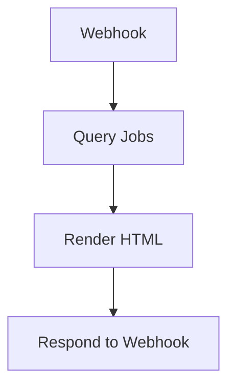
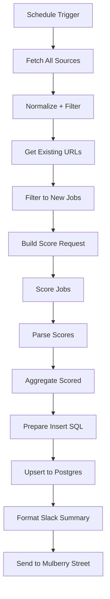

# Job board

Two workflows that work together to surface remote dev jobs the boss is actually
qualified for. The fetcher applies an **LLM fit score** before anything hits the
table — so the board only shows jobs Anthony is highly likely to interview for.

## Fetcher

`agent/n8n/workflows/bugsy-job-board-fetcher.json` — daily cron, 5:30am CT M-F.

The fetcher pipeline (all 1→1 along the score path — see [Why batched](#why-batched-not-per-item) below):

1. **Fetch All Sources** — pull 20+ job boards (5 JSON APIs + 16 RSS feeds) concurrently via axios.
2. **Normalize + Filter** — parse each source's shape, dedupe by URL within the batch, filter to listings that mention Anthony's stack.
3. **Get Existing URLs** — Postgres `SELECT array_agg(url) FROM job_listings`. Anything already stored skips the LLM step (saves tokens, prevents re-scoring on schedule jitter).
4. **Filter to New Jobs** — drop URLs already in DB, output one item containing the full new-jobs array plus pre-score stats.
5. **Build Score Request** — build ONE batched LiteLLM payload that lists every new job with a numeric id. Capped at 100 jobs per run; any extra defers to tomorrow (those URLs stay "new"). The system prompt is the source of truth for fit criteria — see [Scoring profile](#scoring-profile) below.
6. **Score Jobs** — single HTTP POST to `http://litellm:4000/v1/chat/completions` (model: `claude-haiku-4-5`, temp 0.1, max_tokens 8000, 120s timeout). `onError: continueRegularOutput` so a flaky LLM doesn't crash the run.
7. **Parse Scores** — strict JSON parse of `{"results":[{id,score,reason}, ...]}`. Maps each result back to its job by id; jobs the LLM forgot default to `score=0, reason="no score returned"` and get dropped at the threshold.
8. **Aggregate Scored** — apply the threshold (default 75), produce stats including `remainderCount` for any deferred jobs.
9. **Prepare Insert SQL** — only kept jobs (≥ threshold) get INSERT rows, with `match_score`, `match_reason`, `scored_at` populated.
10. **Upsert to Postgres** — `INSERT ... ON CONFLICT (url) DO NOTHING`.
11. **Format Slack Summary** — `N new jobs cleared the 75 fit score (out of M scored, K dropped)`, plus the top 3 picks by score and a remainder note if jobs were deferred.
12. **Send to Mulberry Street** — Slack channel `C0AV83XUSTU`.

### Why batched, not per-item

The first cut of this workflow ran one HTTP request per job, iterating n8n's per-item path. In practice n8n silently dropped most items between *Build Score Request* and *Aggregate Scored* — a 626-fetched / 444-stored / 182-new run scored only 1 job. Batching all jobs into a single LLM call (1→1 the whole way down) avoids that iteration entirely, and the system prompt only has to go over the wire once, so it's cheaper too. The 100-job cap keeps us inside Claude Haiku's 8k output budget; backlog spills into the next day.

### Scoring profile

The fit criteria live in the **Build Score Request** Code node's system prompt — that's
the canonical place to update the profile. Right now it scores against:

- **Profile (high score):** React, Next.js, Node, TypeScript, React Native, Flutter, Python/FastAPI, GCP/Firebase, Docker, AI/ML integration (LLM apps, RAG, agent workflows). Bonus for healthtech / fintech.
- **Anti-profile (low score):** Java/Spring Boot, C#/.NET, Salesforce/SAP/Oracle, pure data engineering, ML research roles, embedded/firmware, deep K8s SRE, financial analyst, pure design, game dev, EM/director roles.

The model returns `{"score": 0-100, "reason": "<one short sentence>"}`. The threshold
constant is in the **Aggregate Scored** node (`const THRESHOLD = 75`). Tune it after a
few runs feel right.

### Tuning the threshold

To raise/lower the bar, edit `THRESHOLD` in the **Aggregate Scored** Code node and
re-import. Existing rows in the table are **not** re-scored — old jobs keep whatever
score they got at fetch time. If you change the rubric significantly, consider a
one-shot backfill (re-run the score request against rows where `scored_at` is older
than the rubric change).

## UI

`agent/n8n/workflows/bugsy-job-board-ui.json` — webhook GET `/job-board`. Queries
Postgres ordered by `match_score DESC` and renders a dark-mode HTML board. Live at:

```
https://n8n.coffey.codes/webhook/job-board
```

Header controls:

- Search (title / company / tag / reason)
- Source dropdown
- Status dropdown (new / reviewed / dismissed — localStorage-backed)
- **Min score slider** (default 75) — drag to 0 to see everything, including pre-scoring rows
- Sort: best fit first (default) / newest first / company / source

Each row leads with a colored score badge (green ≥90, blue ≥75, amber ≥50, red <50,
grey for null). Hover the badge for the full LLM rationale; the rationale also appears
inline under the title.

## Schema (`job_listings` table)

| Column | Type | Notes |
|---|---|---|
| `id` | SERIAL PK | |
| `source` | TEXT | Board name (e.g. `remotive`, `wwr-frontend`) |
| `title` | TEXT | |
| `company` | TEXT | |
| `url` | TEXT UNIQUE | Dedup key |
| `location` | TEXT | Always `'Remote'` currently |
| `salary_raw` | TEXT | Raw string from source |
| `tech_tags` | TEXT[] | Matched from STACK keyword list |
| `description` | TEXT | Stripped HTML, max 600 chars |
| `posted_at` | TIMESTAMPTZ | |
| `fetched_at` | TIMESTAMPTZ | Default `now()` |
| `status` | TEXT | `new` \| `reviewed` \| `dismissed` |
| `match_score` | INT | 0–100 LLM fit score (added migration 003). Only jobs ≥ threshold get inserted, so this is non-null on every fetcher-inserted row. |
| `match_reason` | TEXT | One-line LLM rationale that explains the score. |
| `scored_at` | TIMESTAMPTZ | When the score was computed. |

## Known gotchas

- **Some sources have blocked the VM IP** — listings still get stored, but direct access from the VM may fail. Apply to jobs from a personal machine, not routed through Bugsy.
- **UI status (reviewed/dismissed) is stored in browser `localStorage`** — doesn't sync across devices. A future refactor would persist back to `job_listings.status`.
- **Pre-migration rows have `NULL` match_score** — they were stored before the scoring step existed. They show as `—` in the UI and only appear when the min-score slider is at 0.
- **Threshold changes don't backfill** — old rows keep their original score. Re-scoring is a manual one-shot job.
- **LLM scoring is one batched call** — single LiteLLM round-trip per run, capped at 100 jobs. If a day fetches more than 100 net-new URLs, the rest defers to tomorrow (they're still "new" until inserted). Slack note flags when this happens.
- **External job links navigate the current tab** — earlier `target="_blank"` triggered Chrome's `ERR_BLOCKED_BY_RESPONSE` on the popup because of Cross-Origin-Opener-Policy enforcement on the opener page (set somewhere in the n8n/Cloudflare path that the Respond to Webhook header overrides couldn't beat). Same-tab navigation has no popup, no opener, no COOP. Middle-click or right-click → "Open in new tab" still works for users who want a separate tab — those are user-initiated navigations and Chrome doesn't enforce popup isolation on them.

<!-- NODE-REF:START:bugsy-job-board-ui — auto-generated by agent/n8n/scripts/generate-workflow-reference.mjs; do not edit by hand -->

## Node reference: Bugsy — Job Board UI

> Auto-generated from `agent/n8n/workflows/bugsy-job-board-ui.json` on 2026-05-11. Run `node agent/n8n/scripts/generate-workflow-reference.mjs` to refresh.

**Active:** `false` · **Nodes:** 4 · **Execution order:** `v1`

### Flow



### Nodes

#### Webhook
*Type:* `n8n-nodes-base.webhook`

- **Method:** `GET`
- **Path:** `/job-board`
- **Response mode:** `responseNode`

#### Query Jobs
*Type:* `n8n-nodes-base.postgres`

- **Operation:** `executeQuery`

**Query:**
```sql
SELECT id, source, title, company, url, location, salary_raw, tech_tags, description, posted_at, status, match_score, match_reason, scored_at FROM job_listings ORDER BY match_score DESC NULLS LAST, posted_at DESC NULLS LAST, fetched_at DESC LIMIT 500
```

- **Credential (postgres):** `Postgres — agent DB`

#### Render HTML
*Type:* `n8n-nodes-base.code`

```javascript
// Normalize tech_tags — postgres TEXT[] can arrive as "{tag1,tag2}" string;
// calling .map() on a string throws silently and leaves the table blank.
const rows = $input.all().map(i => {
  const r = Object.assign({}, i.json);
  if (typeof r.tech_tags === 'string') {
    r.tech_tags = r.tech_tags.replace(/^\{|\}$/g, '').split(',').filter(Boolean);
  } else if (!Array.isArray(r.tech_tags)) {
    r.tech_tags = [];
  }
  return r;
});

const jobsJson = JSON.stringify(rows).replace(/</g,'\\u003c').replace(/>/g,'\\u003e').replace(/&/g,'\\u0026');

const sources = [...new Set(rows.map(r => r.source))].sort();
const sourceOptions = sources.map(s => `<option value="${s}">${s}</option>`).join('');

const html = `<!DOCTYPE html>
<html lang="en">
<head>
<meta charset="UTF-8">
<meta name="viewport" content="width=device-width, initial-scale=1.0">
<title>Bugsy Job Board</title>
<style>
  * { box-sizing: border-box; margin: 0; padding: 0; }
  body { font-family: -apple-system, BlinkMacSystemFont, 'Segoe UI', sans-serif; background: #0f1117; color: #e2e8f0; min-height: 100vh; }
  header { background: #1a1d27; border-bottom: 1px solid #2d3148; padding: 16px 24px; display: flex; align-items: center; gap: 16px; flex-wrap: wrap; }
  header h1 { font-size: 18px; font-weight: 700; color: #fff; white-space: nowrap; }
  header h1 span { color: #f97316; }
  .filters { display: flex; gap: 10px; flex: 1; flex-wrap: wrap; align-items: center; }
  .filters input, .filters select { background: #0f1117; border: 1px solid #2d3148; color: #e2e8f0; padding: 7px 12px; border-radius: 6px; font-size: 13px; outline: none; }
  .filters input[type=text] { flex: 1; min-width: 160px; }
  .filters input:focus, .filters select:focus { border-color: #f97316; }
  .score-filter { display: flex; align-items: center; gap: 6px; font-size: 12px; color: #94a3b8; white-space: nowrap; }
  .score-filter input[type=range] { width: 90px; accent-color: #f97316; }
  .score-filter span { color: #f97316; font-weight: 600; min-width: 20px; text-align: right; }
  .stats { font-size: 12px; color: #64748b; white-space: nowrap; }
  .container { padding: 0; }
  table { width: 100%; border-collapse: collapse; font-size: 13px; }
  thead th { background: #1a1d27; color: #94a3b8; font-weight: 600; text-align: left; padding: 10px 14px; position: sticky; top: 0; border-bottom: 1px solid #2d3148; font-size: 11px; text-transform: uppercase; letter-spacing: 0.05em; cursor: pointer; user-select: none; white-space: nowrap; }
  thead th:hover { color: #f97316; }
  tbody tr { border-bottom: 1px solid #1e2235; transition: background 0.1s; }
  tbody tr:hover { background: #1a1d27; }
  tbody tr.dismissed { opacity: 0.35; }
  tbody tr.reviewed { background: #1a2a1a; }
  td { padding: 10px 14px; vertical-align: top; }
  td.score-col { white-space: nowrap; width: 1%; }
  .score-badge { display: inline-block; min-width: 38px; text-align: center; padding: 3px 8px; border-radius: 4px; font-size: 12px; font-weight: 700; cursor: help; }
  .score-90 { background: #14532d; color: #4ade80; }
  .score-75 { background: #1e3a8a; color: #93c5fd; }
  .score-50 { background: #422006; color: #fbbf24; }
  .score-25 { background: #3b1515; color: #f87171; }
  .score-na { background: #1e2235; color: #64748b; }
  td.title-col { max-width: 280px; }
  td.title-col a { color: #60a5fa; text-decoration: none; font-weight: 500; display: block; }
  td.title-col a:hover { color: #93c5fd; text-decoration: underline; }
  td.title-col .reason { color: #64748b; font-size: 11px; margin-top: 3px; font-style: italic; }
  td.company-col { color: #94a3b8; white-space: nowrap; max-width: 140px; overflow: hidden; text-overflow: ellipsis; }
  td.source-col { color: #64748b; font-size: 11px; white-space: nowrap; }
  td.salary-col { color: #4ade80; font-size: 12px; white-space: nowrap; }
  td.tags-col { max-width: 200px; }
  .tag { display: inline-block; background: #1e2a3a; color: #60a5fa; border-radius: 4px; padding: 2px 7px; font-size: 10px; margin: 1px 2px 1px 0; white-space: nowrap; }
  td.date-col { color: #64748b; font-size: 11px; white-space: nowrap; }
  td.actions-col { white-space: nowrap; }
  .btn { border: none; border-radius: 4px; padding: 4px 10px; font-size: 11px; cursor: pointer; font-weight: 500; }
  .btn-reviewed { background: #166534; color: #4ade80; }
  .btn-dismissed { background: #3b1515; color: #f87171; }
  .btn:hover { opacity: 0.8; }
  .empty { text-align: center; padding: 60px; color: #64748b; }
  @media (max-width: 768px) { td.tags-col, td.date-col, td.title-col .reason { display: none; } }
</style>
</head>
<body>
<header>
  <h1>🗂 <span>Bugsy</span> Job Board</h1>
  <div class="filters">
    <input type="text" id="search" placeholder="Search title, company, tag..." oninput="render()">
    <select id="source" onchange="render()"><option value="">All sources</option>${sourceOptions}</select>
    <select id="status" onchange="render()">
      <option value="">All</option>
      <option value="new">New</option>
      <option value="reviewed">Reviewed</option>
      <option value="dismissed">Dismissed</option>
    </select>
    <label class="score-filter">Min score <input type="range" id="minScore" min="0" max="100" step="5" value="75" oninput="render()"><span id="minScoreLabel">75</span></label>
    <select id="sort" onchange="render()">
      <option value="score">Best fit first</option>
      <option value="posted_at">Newest first</option>
      <option value="company">Company A-Z</option>
      <option value="source">Source</option>
    </select>
  </div>
  <div class="stats" id="stats"></div>
</header>
<div class="container">
<table>
  <thead>
    <tr>
      <th>Score</th>
      <th>Title</th>
      <th>Company</th>
      <th>Source</th>
      <th>Salary</th>
      <th class="tags-col">Stack</th>
      <th class="date-col">Posted</th>
      <th>Actions</th>
    </tr>
  </thead>
  <tbody id="tbody"></tbody>
</table>
</div>
<script>
const ALL = ${jobsJson};

// localStorage may be blocked in sandboxed iframes; degrade gracefully.
const ls = { get: k => { try { return localStorage.getItem(k); } catch(e) { return null; } }, set: (k,v) => { try { localStorage.setItem(k,v); } catch(e) {} } };
const statuses = JSON.parse(ls.get('jb_statuses')||'{}');

function getStatus(row) { return statuses[row.id] || row.status || 'new'; }

function saveStatus(id, s) { statuses[id] = s; ls.set('jb_statuses', JSON.stringify(statuses)); render(); }
function markReviewed(id) { saveStatus(id, 'reviewed'); }
function markDismissed(id) { saveStatus(id, 'dismissed'); }

function relativeDate(s) {
  if (!s) return '—';
  const diff = Date.now() - new Date(s).getTime();
  const h = Math.floor(diff/3600000);
  if (h < 1) return 'just now';
  if (h < 24) return h+'h ago';
  return Math.floor(h/24)+'d ago';
}

function scoreClass(s) {
  if (s == null) return 'score-na';
  if (s >= 90) return 'score-90';
  if (s >= 75) return 'score-75';
  if (s >= 50) return 'score-50';
  return 'score-25';
}

function escapeHtml(s) { return String(s||'').replace(/[&<>"']/g, c => ({'&':'&amp;','<':'&lt;','>':'&gt;','"':'&quot;',"'":'&#39;'})[c]); }

function render() {
  const q = document.getElementById('search').value.toLowerCase();
  const src = document.getElementById('source').value;
  const st = document.getElementById('status').value;
  const minScore = parseInt(document.getElementById('minScore').value, 10);
  document.getElementById('minScoreLabel').textContent = minScore;
  const sortBy = document.getElementById('sort').value;

  let rows = ALL.filter(r => {
    const s = getStatus(r);
    if (st && s !== st) return false;
    if (src && r.source !== src) return false;
    // Pre-scoring rows have null match_score — keep them visible at min=0,
    // hide them at any other minimum so the boss isn't staring at unscored noise.
    const sc = (r.match_score == null) ? -1 : r.match_score;
    if (minScore > 0 && sc < minScore) return false;
    if (q) {
      const hay = (r.title+r.company+(r.tech_tags||[]).join(' ')+(r.description||'')+(r.match_reason||'')).toLowerCase();
      if (!hay.includes(q)) return false;
    }
    return true;
  });

  if (sortBy === 'company') rows.sort((a,b)=>(a.company||'').localeCompare(b.company||''));
  else if (sortBy === 'source') rows.sort((a,b)=>a.source.localeCompare(b.source));
  else if (sortBy === 'posted_at') rows.sort((a,b)=>new Date(b.posted_at||0)-new Date(a.posted_at||0));
  else rows.sort((a,b)=>(b.match_score||-1)-(a.match_score||-1));

  document.getElementById('stats').textContent = rows.length + ' jobs';

  const tbody = document.getElementById('tbody');
  if (!rows.length) { tbody.innerHTML = '<tr><td colspan="8" class="empty">No jobs match your filters.</td></tr>'; return; }

  tbody.innerHTML = rows.map(r => {
    const s = getStatus(r);
    const tags = (r.tech_tags||[]).slice(0,5).map(t=>'<span class="tag">'+escapeHtml(t)+'</span>').join('');
    const scoreLabel = (r.match_score == null) ? '—' : r.match_score;
    const scoreTitle = r.match_reason ? escapeHtml(r.match_reason) : 'No fit reason recorded';
    const reasonInline = r.match_reason ? '<div class="reason">'+escapeHtml(r.match_reason)+'</div>' : '';
    return '<tr class="'+s+'" data-id="'+r.id+'">' +
      '<td class="score-col"><span class="score-badge '+scoreClass(r.match_score)+'" title="'+scoreTitle+'">'+scoreLabel+'</span></td>' +
      '<td class="title-col"><a href="'+r.url+'" rel="noreferrer" referrerpolicy="no-referrer">'+escapeHtml(r.title)+'</a>'+reasonInline+'</td>' +
      '<td class="company-col">'+escapeHtml(r.company||'—')+'</td>' +
      '<td class="source-col">'+escapeHtml(r.source)+'</td>' +
      '<td class="salary-col">'+escapeHtml(r.salary_raw||'—')+'</td>' +
      '<td class="tags-col">'+tags+'</td>' +
      '<td class="date-col">'+relativeDate(r.posted_at)+'</td>' +
      '<td class="actions-col">' +
        '<button class="btn btn-reviewed" onclick="markReviewed('+r.id+')">✓</button> ' +
        '<button class="btn btn-dismissed" onclick="markDismissed('+r.id+')">✕</button>' +
      '</td>' +
    '</tr>';
  }).join('');
}

render();
<\/script>
</body>
</html>`;

return [{ json: { html } }];
```

#### Respond to Webhook
*Type:* `n8n-nodes-base.respondToWebhook`

- **Respond with:** `text`

**Body:**
```text
={{ $json.html }}
```

<!-- NODE-REF:END:bugsy-job-board-ui -->

<!-- NODE-REF:START:bugsy-job-board-fetcher — auto-generated by agent/n8n/scripts/generate-workflow-reference.mjs; do not edit by hand -->

## Node reference: Bugsy — Job Board Fetcher (daily)

> Auto-generated from `agent/n8n/workflows/bugsy-job-board-fetcher.json` on 2026-05-11. Run `node agent/n8n/scripts/generate-workflow-reference.mjs` to refresh.

**Active:** `false` · **Nodes:** 13 · **Execution order:** `v1`

### Flow



### Nodes

#### Schedule Trigger
*Type:* `n8n-nodes-base.scheduleTrigger`

- **Schedule:** cron `30 5 * * 1-5`
- **Timezone:** `America/Chicago`

#### Fetch All Sources
*Type:* `n8n-nodes-base.code`

```javascript
const axios = require('axios');

// ── JSON APIs ─────────────────────────────────────────────────────────────────
const JSON_SOURCES = [
  { id: 'remotive',         url: 'https://remotive.com/api/remote-jobs?category=software-development&limit=100' },
  { id: 'remotive-ai',      url: 'https://remotive.com/api/remote-jobs?category=artificial-intelligence&limit=100' },
  { id: 'jobicy',           url: 'https://jobicy.com/api/v2/remote-jobs?industry=dev&count=50' },
  { id: 'workingnomads',    url: 'https://www.workingnomads.com/api/exposed_jobs/?category=development' },
  { id: 'arbeitnow',        url: 'https://www.arbeitnow.com/api/job-board-api?remote=true' },
];

// ── RSS Feeds ─────────────────────────────────────────────────────────────────
const RSS_SOURCES = [
  { id: 'wwr-frontend',      url: 'https://weworkremotely.com/categories/remote-front-end-programming-jobs.rss' },
  { id: 'wwr-backend',       url: 'https://weworkremotely.com/categories/remote-back-end-programming-jobs.rss' },
  { id: 'wwr-fullstack',     url: 'https://weworkremotely.com/categories/remote-full-stack-programming-jobs.rss' },
  { id: 'wwr-devops',        url: 'https://weworkremotely.com/categories/remote-devops-sysadmin-jobs.rss' },
  { id: 'remotive-sw-rss',   url: 'https://remotive.com/remote-jobs/feed/software-development' },
  { id: 'remotive-ai-rss',   url: 'https://remotive.com/remote-jobs/feed/artificial-intelligence' },
  { id: 'rfj-react',         url: 'https://remotefirstjobs.com/rss/jobs/react.rss' },
  { id: 'rfj-python',        url: 'https://remotefirstjobs.com/rss/jobs/python.rss' },
  { id: 'rfj-ai',            url: 'https://remotefirstjobs.com/rss/jobs/ai.rss' },
  { id: 'larajobs',          url: 'https://larajobs.com/feed' },
  { id: 'wp-jobs',           url: 'https://jobs.wordpress.net/feed/' },
  { id: 'pyjobs',            url: 'https://www.pyjobs.com/rss' },
  { id: 'python-org',        url: 'https://www.python.org/jobs/feed/rss/' },
  { id: 'vuejobs',           url: 'https://app.vuejobs.com/feed/posts' },
  { id: 'authenticjobs',     url: 'https://authenticjobs.com/?feed=job_feed' },
  { id: 'realwork-frontend', url: 'https://www.realworkfromanywhere.com/remote-frontend-jobs/rss.xml' },
];

async function fetchOne(src, isRss) {
  try {
    const res = await axios.get(src.url, {
      timeout: 15000,
      responseType: isRss ? 'text' : 'json',
      headers: { 'User-Agent': 'Bugsy-JobBot/1.0' },
    });
    return { id: src.id, ok: true, data: res.data };
  } catch (e) {
    return { id: src.id, ok: false, data: null, error: e.message };
  }
}

const [jsonResults, rssResults] = await Promise.all([
  Promise.all(JSON_SOURCES.map(s => fetchOne(s, false))),
  Promise.all(RSS_SOURCES.map(s => fetchOne(s, true))),
]);

const failed = [...jsonResults, ...rssResults].filter(r => !r.ok).map(r => r.id);
return [{ json: { jsonResults, rssResults, failed } }];
```

#### Normalize + Filter
*Type:* `n8n-nodes-base.code`

```javascript
function extractTag(tag, xml) {
  const cdata = xml.match(new RegExp('<' + tag + '><!\\[CDATA\\[([\\s\\S]*?)\\]\\]><\\/' + tag + '>'));
  if (cdata) return cdata[1].trim();
  const plain = xml.match(new RegExp('<' + tag + '[^>]*>([\\s\\S]*?)<\\/' + tag + '>'));
  return plain ? plain[1].replace(/<[^>]+>/g, '').trim() : '';
}
function extractLink(xml) {
  const href = xml.match(/<link[^>]+href="([^"]+)"/);
  if (href) return href[1].trim();
  const tag = xml.match(/<link>([^<]*)<\/link>/);
  return tag ? tag[1].trim() : '';
}
function parseRSS(xml, src) {
  const re = /<item[^>]*>([\s\S]*?)<\/item>|<entry[^>]*>([\s\S]*?)<\/entry>/g;
  const out = []; let m;
  while ((m = re.exec(xml)) !== null) {
    const b = m[1] || m[2];
    out.push({ source: src, title: extractTag('title', b), link: extractLink(b) || extractTag('guid', b), pubDate: extractTag('pubDate', b) || extractTag('published', b), description: extractTag('description', b) || extractTag('summary', b), company: extractTag('author', b) || extractTag('dc:creator', b) });
  }
  return out;
}

const STACK = ['react','next.js','nextjs','vue','nuxt','angular','flutter','expo','node','nodejs','express','python','flask','django','fastapi','php','laravel','wordpress','typescript','javascript','docker','kubernetes','devops','terraform','aws','gcp','firebase','postgresql','mysql','mongodb','redis','openai','llm','langchain','gemini','machine learning','pytorch','tensorflow','three.js','threejs','mobile','ios','android'];

function isRelevant(t, d) { const s = ((t||'')+(d||'')).toLowerCase(); return STACK.some(k => s.includes(k)); }
function getTags(text) { const s = (text||'').toLowerCase(); return [...new Set(STACK.filter(k => s.includes(k)))]; }
function nd(s) { if (!s) return null; try { const d = new Date(s); return isNaN(d.getTime()) ? null : d.toISOString(); } catch(e) { return null; } }
function strip(s) { return (s||'').replace(/<[^>]+>/g,' ').replace(/\s+/g,' ').trim().substring(0,600); }

const { jsonResults, rssResults } = $input.first().json;
const jobs = [];
const seen = new Set();

function add(j) {
  if (!j.url || seen.has(j.url)) return;
  if (!isRelevant(j.title, j.desc)) return;
  seen.add(j.url);
  jobs.push({ source: j.src||'unknown', title: (j.title||'').substring(0,200), company: (j.company||'').substring(0,100), url: j.url, location: 'Remote', salary_raw: (j.salary||'').substring(0,100), tech_tags: getTags((j.title||'')+(j.desc||'')), description: strip(j.desc), posted_at: nd(j.date) });
}

for (const r of jsonResults) {
  if (!r.ok || !r.data) continue;
  try {
    if (r.id === 'remotive' || r.id === 'remotive-ai') {
      for (const j of (r.data.jobs||[])) add({src:r.id,title:j.title,company:j.company_name,url:j.url,salary:j.salary,desc:j.description,date:j.publication_date});
    } else if (r.id === 'jobicy') {
      for (const j of (r.data.jobs||[])) add({src:'jobicy',title:j.jobTitle,company:j.companyName,url:j.url,salary:j.annualSalaryMin?('
+j.annualSalaryMin+'-
+j.annualSalaryMax):'',desc:j.jobDescription,date:j.pubDate});
    } else if (r.id === 'workingnomads') {
      for (const j of (Array.isArray(r.data)?r.data:[])) add({src:'workingnomads',title:j.title,company:j.company,url:j.url,desc:j.description,date:j.pub_date});
    } else if (r.id === 'arbeitnow') {
      for (const j of ((r.data.data||[]).filter(x=>x.remote))) add({src:'arbeitnow',title:j.title,company:j.company_name,url:j.url,desc:j.description,date:j.created_at});
    }
  } catch(e) {}
}

for (const r of rssResults) {
  if (!r.ok || !r.data) continue;
  try {
    for (const item of parseRSS(r.data, r.id)) {
      add({src:item.source,title:item.title,company:item.company,url:item.link,desc:item.description,date:item.pubDate});
    }
  } catch(e) {}
}

return [{ json: { jobs, total: jobs.length } }];
```

#### Get Existing URLs
*Type:* `n8n-nodes-base.postgres`

- **Operation:** `executeQuery`

**Query:**
```sql
SELECT COALESCE(array_agg(url), ARRAY[]::TEXT[]) AS urls FROM job_listings
```

- **Credential (postgres):** `Postgres — agent DB`

#### Filter to New Jobs
*Type:* `n8n-nodes-base.code`

```javascript
// Drop URLs already stored. Outputs ONE item containing the full new-jobs batch —
// downstream uses a single batched LLM call instead of per-item iteration
// (n8n's per-item HTTP path was silently dropping items, so the whole score
// path runs as 1→1 now).
const allJobs = $('Normalize + Filter').first().json.jobs || [];
const row = $input.first().json || {};
const urls = Array.isArray(row.urls) ? row.urls : (typeof row.urls === 'string' ? row.urls.replace(/^\{|\}$/g,'').split(',').filter(Boolean) : []);
const existing = new Set(urls);
const newJobs = allJobs.filter(j => !existing.has(j.url));
return [{ json: { newJobs, fetchedTotal: allJobs.length, alreadyStored: allJobs.length - newJobs.length, newCount: newJobs.length } }];
```

#### Build Score Request
*Type:* `n8n-nodes-base.code`

```javascript
// Build ONE batched LiteLLM payload that scores every new job in a single round-trip.
// 100-job cap keeps us inside Claude Haiku's 8k output budget; if there's a backlog,
// the leftover scores tomorrow when those URLs are still 'new'.
const MAX_BATCH = 100;
const { newJobs } = $input.first().json;
const all = newJobs || [];
const batch = all.slice(0, MAX_BATCH);
const remainderCount = all.length - batch.length;

const systemPrompt = [
  'You are a strict hiring-fit scorer for Anthony Coffey, a senior full-stack developer.',
  '',
  'PROFILE — Anthony is highly qualified for:',
  '- Full-stack web: React, Next.js, Node.js, TypeScript, JavaScript',
  '- Mobile: React Native, Flutter, iOS, Android, Expo',
  '- Backend: Node.js, Python, Express, FastAPI',
  '- Cloud / infra: GCP, Firebase, Docker',
  '- AI/ML INTEGRATION: LLM apps, RAG, OpenAI/Anthropic APIs, agent workflows, prompt eng',
  '- Bonus: security-conscious environments (healthtech, fintech)',
  '',
  'ANTI-PROFILE — score these LOW (Anthony lacks significant experience):',
  '- Java / Spring / Spring Boot',
  '- C# / .NET / ASP.NET',
  '- Salesforce, SAP, Oracle, COBOL, mainframe, AS/400',
  '- Pure data engineering (Hadoop, Spark, Scala, Kafka-heavy)',
  '- ML research roles (PyTorch / TensorFlow research, model training)',
  '- Embedded / firmware / C / C++ / Rust systems',
  '- DevOps-only / SRE-only roles requiring deep K8s expertise',
  '- Financial analyst / quant / trader roles',
  '- Pure design / UX roles',
  '- Game dev (Unity, Unreal)',
  '- Senior engineering manager / EM / director roles (Anthony is an IC)',
  '',
  'Rubric:',
  '- 90-100: Strong direct match. Senior full-stack, AI integration, or React/RN/Flutter explicit.',
  '- 75-89:  Solid fit. Most criteria match; minor gaps OK.',
  '- 50-74:  Partial overlap but key skill mismatched (e.g. PHP/Laravel-heavy).',
  '- 25-49:  Mostly outside profile (Java backend, .NET, etc.).',
  '- 0-24:   Anti-profile (Spring Boot, Salesforce, financial analyst, etc.).',
  '',
  'You will receive a numbered list of jobs. Score every job independently.',
  'Respond with ONLY this JSON (no commentary, no markdown fences):',
  '{"results":[{"id":<integer>,"score":<integer 0-100>,"reason":"<short sentence, max 15 words>"}, ...]}',
  '',
  'CRITICAL: include exactly one entry per job, using the numeric id from the input. Be honest — the boss only wants jobs he is likely to interview for.'
].join('\n');

const jobLines = batch.map((j, i) => {
  return `[${i+1}] Title: ${(j.title||'').substring(0,160)} | Company: ${(j.company||'').substring(0,80)} | Tags: ${(j.tech_tags||[]).join(', ') || '—'} | Description: ${(j.description||'').substring(0,260)}`;
}).join('\n\n');

const userPrompt = batch.length
  ? ('Score every job below. Return one result per id.\n\n' + jobLines)
  : 'Return {"results":[]}.';

return [{ json: {
  payload: {
    model: 'claude-haiku-4-5',
    messages: [
      { role: 'system', content: systemPrompt },
      { role: 'user',   content: userPrompt }
    ],
    temperature: 0.1,
    max_tokens: 8000
  },
  batch,
  remainderCount,
  emptyBatch: batch.length === 0
}}];
```

#### Score Jobs
*Type:* `n8n-nodes-base.httpRequest`

- **Method:** `POST`
- **URL:** `http://litellm:4000/v1/chat/completions`
- **Auth:** `genericCredentialType` (httpHeaderAuth)
- **Timeout:** 120000ms

**Headers:**
- `Content-Type`: `application/json`

**Body:**
```json
={{ JSON.stringify($json.payload) }}
```

- **Credential (httpHeaderAuth):** `LiteLLM Bearer`
- **On error:** `continueRegularOutput`

#### Parse Scores
*Type:* `n8n-nodes-base.code`

````javascript
// Map LLM scores back onto each job by id. Any job the LLM forgot defaults to score=0
// so it gets dropped at the threshold step instead of silently disappearing.
const llm = $json || {};
const { batch, remainderCount, emptyBatch } = $('Build Score Request').first().json;

let results = [];
let parseError = null;
if (!emptyBatch) {
  try {
    const content = (llm.choices && llm.choices[0] && llm.choices[0].message && llm.choices[0].message.content) || '';
    const cleaned = content.replace(/^```(?:json)?\s*/i, '').replace(/\s*```\s*$/i, '').trim();
    const parsed = JSON.parse(cleaned);
    results = Array.isArray(parsed.results) ? parsed.results : [];
  } catch (e) {
    parseError = e.message;
  }
}

const byId = new Map();
for (const r of results) {
  const id = parseInt(r.id, 10);
  if (Number.isFinite(id)) {
    byId.set(id, {
      score: Math.max(0, Math.min(100, parseInt(r.score, 10) || 0)),
      reason: String(r.reason || '').substring(0, 300)
    });
  }
}

const now = new Date().toISOString();
const scoredJobs = (batch || []).map((job, i) => {
  const r = byId.get(i + 1);
  return Object.assign({}, job, {
    match_score: r ? r.score : 0,
    match_reason: r ? r.reason : (parseError ? ('parse error: ' + parseError) : 'no score returned'),
    scored_at: now
  });
});

return [{ json: { scoredJobs, remainderCount, parseError } }];
````

#### Aggregate Scored
*Type:* `n8n-nodes-base.code`

```javascript
const THRESHOLD = 75;
const { scoredJobs, remainderCount, parseError } = $input.first().json;
const items = scoredJobs || [];
const kept = items.filter(j => (j.match_score || 0) >= THRESHOLD);
const dropped = items.filter(j => (j.match_score || 0) < THRESHOLD);
kept.sort((a,b) => (b.match_score||0) - (a.match_score||0));

const filterMeta = $('Filter to New Jobs').first().json;

return [{ json: {
  kept,
  droppedCount: dropped.length,
  totalScored: items.length,
  threshold: THRESHOLD,
  fetchedTotal: filterMeta.fetchedTotal || 0,
  alreadyStored: filterMeta.alreadyStored || 0,
  remainderCount: remainderCount || 0,
  parseError: parseError || null,
  topThree: kept.slice(0, 3).map(j => ({ title: j.title, company: j.company, score: j.match_score, reason: j.match_reason }))
}}];
```

#### Prepare Insert SQL
*Type:* `n8n-nodes-base.code`

```javascript
const { kept } = $input.first().json;
if (!kept || kept.length === 0) return [{ json: { sql: 'SELECT 1', total: 0 } }];
function esc(v) { return String(v||'').replace(/'/g,"''"); }
function escArr(a) { if (!a||!a.length) return "'{}'" ; return 'ARRAY['+a.map(t=>"'"+ esc(t)+"'").join(',')+']'; }
const rows = kept.map(j=>`('${esc(j.source)}','${esc(j.title)}','${esc(j.company)}','${esc(j.url)}','${esc(j.location)}','${esc(j.salary_raw)}',${escArr(j.tech_tags)},'${esc(j.description)}',${j.posted_at?"'"+j.posted_at+"'":'NULL'},${parseInt(j.match_score,10)||0},'${esc(j.match_reason)}','${j.scored_at}')`);
const sql = 'INSERT INTO job_listings (source,title,company,url,location,salary_raw,tech_tags,description,posted_at,match_score,match_reason,scored_at)\nVALUES\n'+rows.join(',\n')+'\nON CONFLICT (url) DO NOTHING';
return [{ json: { sql, total: kept.length } }];
```

#### Upsert to Postgres
*Type:* `n8n-nodes-base.postgres`

- **Operation:** `executeQuery`

**Query:**
```sql
={{ $json.sql }}
```

- **Credential (postgres):** `Postgres — agent DB`

#### Format Slack Summary
*Type:* `n8n-nodes-base.code`

```javascript
const agg = $('Aggregate Scored').first().json;
const inserted = $('Prepare Insert SQL').first().json.total || 0;
const date = new Date().toLocaleDateString('en-US', { weekday: 'short', month: 'short', day: 'numeric' });
const threshold = agg.threshold || 75;
const topLines = (agg.topThree || []).map(t => `• *${t.score}* — ${t.title} @ ${t.company || '?'}`).join('\n');
const topBlock = topLines ? `\n\n*Top picks:*\n${topLines}` : '';
const remainderNote = (agg.remainderCount > 0) ? `\n_Note: ${agg.remainderCount} extra new jobs deferred to tomorrow's run (batch cap)._` : '';
const parseNote = agg.parseError ? `\n⚠️ _Score parse failed: ${agg.parseError}_` : '';
const slackText = `📋 *Job Board Sweep — ${date}*\n*${inserted} new jobs* cleared the ${threshold} fit score (out of ${agg.totalScored||0} scored, ${agg.droppedCount||0} dropped).\n_Pre-score: ${agg.fetchedTotal||0} fetched, ${agg.alreadyStored||0} already stored._${remainderNote}${parseNote}\nBrowse 'em: <https://n8n.coffey.codes/webhook/job-board|coffey.codes job board>${topBlock}`;
return [{ json: { slackText } }];
```

#### Send to Mulberry Street
*Type:* `n8n-nodes-base.slack`

- **Resource:** `message`
- **Operation:** `post`
- **Channel:** `[object Object]`

**Text:**
```text
={{ $json.slackText }}
```

- **Credential (slackApi):** `Slack - Bugsy`

<!-- NODE-REF:END:bugsy-job-board-fetcher -->
