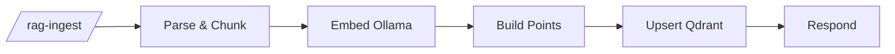
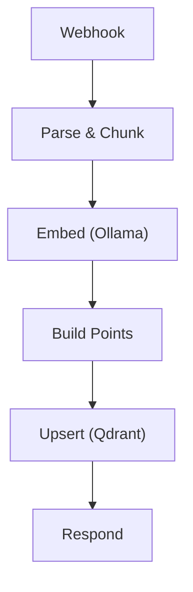

# RAG ingest

`agent/n8n/workflows/bugsy-rag-ingest.json` — turns markdown documents into Qdrant vector points.

## Pipeline



- **Parse & Chunk** — strips YAML frontmatter, resolves a `title` (frontmatter `title:` → first `# H1` → `filename` → `Untitled`), extracts `tags`, slices the body into ~400-char chunks with 50-char overlap. Emits one item per chunk.
- **Embed (Ollama)** — runs `nomic-embed-text` per chunk. Native HTTP Request node so n8n iterates per item automatically.
- **Build Points** — pairs each embedding with its source chunk metadata; UUIDs are deterministic from `doc_id + chunk_index` where `doc_id` is the relative `filename` (rename-safe and collision-free across repos), falling back to `title` for legacy callers.
- **Upsert (Qdrant)** — single PUT with the full point array.
- **Respond** — `✓ N chunks stored — <title>` or an error message with stage info.

## Adding content

```bash
# 1. Drop a markdown file with YAML frontmatter into the right category
cat > ~/agent/rag/bio/about-me.md <<'EOF'
---
title: About Anthony
tags: [bio, summary, voice]
---

I'm a full-stack engineer based in Austin...
EOF

# 2. Run the ingest helper
bash ~/agent/rag-ingest.sh           # all categories
bash ~/agent/rag-ingest.sh bio       # one category

# 3. Verify count went up
docker run --rm --network agent_agent-net curlimages/curl:latest \
  -s http://agent-qdrant:6333/collections/personal_knowledge | jq '.result.points_count'
```

## Categories

```
~/agent/rag/bio/            # resume, about-me, skills
~/agent/rag/articles/       # written/edited articles in your voice
~/agent/rag/case-studies/   # client work writeups
~/agent/rag/projects/       # project descriptions and source-repo doc trees
```

`*.md` is gitignored — content stays private.

## Cloning source repos for git-pull refresh

The ingest script walks subdirectories recursively (`find -L`) and follows symlinks, so any cloned repo's `docs/` tree can plug straight in. Pattern:

```bash
# 1. Clone the repo somewhere stable on the VM
git clone --depth=1 https://github.com/anthonycoffey/<repo>.git ~/<repo>

# 2. Symlink its docs into the right RAG category
ln -s ~/<repo>/docs ~/agent/rag/projects/<repo>

# 3. Ingest
bash ~/agent/rag-ingest.sh projects
```

Refresh later with:

```bash
cd ~/<repo> && git pull
bash ~/agent/rag-ingest.sh projects
```

Idempotency means re-ingesting the same files just overwrites their existing chunks (point IDs are deterministic from `doc_id + chunk_index`). New files are added; renamed files create new chunks at the new path and orphan the old ones — purge those manually if cleanliness matters.

Currently mounted this way: `~/agent/rag/projects/coffey-codes` → `~/coffey.codes/docs` (46 docs).

## Title resolution

The parser tries each source in order and uses the first one that yields a non-empty value:

1. **YAML frontmatter `title:`** — explicit, wins.
2. **First `# H1` heading** in the body — works for any well-formed markdown.
3. **`filename`** sent in the request body (relative path like `projects/_agent/architecture/overview.md`).
4. **`"Untitled"`** — only if everything above is missing.

This means most repos can be ingested as-is — no per-file frontmatter required. Add frontmatter when you want to override the H1 or specify `tags`:

```markdown
---
title: My Resume
tags: [resume, react, node, typescript]
---

Body here.
```

## Idempotency

Each chunk's Qdrant point ID is deterministic from `doc_id + chunk_index`, where `doc_id` is the request `filename` (preferred — rename-safe, collision-free across repos) or the title for legacy callers without a filename. Editing a file and re-running ingest overwrites its existing chunks rather than duplicating them.

**Two collisions to know about:**

- **Same filename in different categories** — won't collide because `rag-ingest.sh` sends `filename` as `<category>/<relative-path>`.
- **Same H1 in two repos** — only matters if neither file has frontmatter *and* neither caller sends a filename. The default script always sends a filename, so this only bites direct webhook callers.

**Caveat:** if the doc shrinks (fewer chunks than before), trailing chunks from the previous version stay orphaned in Qdrant. Worth pruning manually if you regularly shorten docs:

```bash
# delete chunks for a filename where chunk_index >= new total
docker run --rm --network agent_agent-net curlimages/curl:latest \
  -s -X POST http://agent-qdrant:6333/collections/personal_knowledge/points/delete \
  -H "Content-Type: application/json" \
  -d '{"filter":{"must":[{"key":"filename","match":{"value":"bio/resume.md"}},{"key":"chunk_index","range":{"gte":15}}]}}'
```

## Why no Code-node-with-axios?

Earlier this workflow looped axios calls inside one Code node. The n8n task runner subprocess died mid-loop with no recoverable error. Native HTTP Request nodes don't run in the runner sandbox and iterate per-item natively, so the refactor solved both problems at once.

## See also

- [RAG Query](rag-query.md) — read side of the same Qdrant collection

<!-- NODE-REF:START:bugsy-rag-ingest — auto-generated by agent/n8n/scripts/generate-workflow-reference.mjs; do not edit by hand -->

## Node reference: Bugsy — RAG Ingest

> Auto-generated from `agent/n8n/workflows/bugsy-rag-ingest.json` on 2026-05-11. Run `node agent/n8n/scripts/generate-workflow-reference.mjs` to refresh.

**Active:** `false` · **Nodes:** 6 · **Execution order:** `v1`

### Flow



### Nodes

#### Webhook
*Type:* `n8n-nodes-base.webhook`

- **Method:** `POST`
- **Path:** `/rag-ingest`
- **Response mode:** `responseNode`

#### Parse & Chunk
*Type:* `n8n-nodes-base.code`

```javascript
const raw = $input.first().json;
const body = raw.body || raw;
const { category, content, filename } = body;

let text = content;
let title = null;
let tags = [];

// 1) YAML frontmatter (highest priority)
const fmMatch = content.match(/^---\n([\s\S]*?)\n---\n([\s\S]*)$/);
if (fmMatch) {
  const fm = fmMatch[1];
  text = fmMatch[2].trim();
  const titleMatch = fm.match(/^title:\s*(.+)$/m);
  if (titleMatch) title = titleMatch[1].replace(/['"]/g, '').trim();
  const tagsMatch = fm.match(/^tags:\s*\[([^\]]*)\]/m);
  if (tagsMatch) tags = tagsMatch[1].split(',').map(t => t.trim().replace(/['"]/g, ''));
}

// 2) First # H1 heading
if (!title) {
  const h1Match = text.match(/^#\s+(.+)$/m);
  if (h1Match) title = h1Match[1].trim();
}

// 3) Filename → 4) Untitled
if (!title) title = filename || 'Untitled';

// Stable identity for Qdrant point IDs. Prefer filename (rename-safe and
// collision-free across repos); fall back to title only when no filename
// was sent (legacy callers).
const docId = filename || title;

const CHUNK_SIZE = 400;
const OVERLAP = 50;
const chunks = [];
let i = 0;
while (i < text.length) {
  chunks.push(text.slice(i, i + CHUNK_SIZE));
  if (i + CHUNK_SIZE >= text.length) break;
  i += CHUNK_SIZE - OVERLAP;
}

return chunks.map((chunk, idx) => ({
  json: {
    text: chunk,
    title,
    category,
    tags,
    filename: filename || null,
    doc_id: docId,
    chunk_index: idx,
    total_chunks: chunks.length
  }
}));
```

#### Embed (Ollama)
*Type:* `n8n-nodes-base.httpRequest`

- **Method:** `POST`
- **URL:** `http://ollama:11434/api/embeddings`
- **Timeout:** 30000ms

**Body:**
- `model`: `nomic-embed-text`
- `prompt`: `={{ $json.text }}`

#### Build Points
*Type:* `n8n-nodes-base.code`

```javascript
const embeds = $input.all();
const sources = $('Parse & Chunk').all();

// Deterministic UUID from a string (pure JS, no require) so re-ingesting
// the same document overwrites its existing chunks instead of duplicating.
function uuidFromString(s) {
  let h1 = 0x811c9dc5, h2 = 0xdeadbeef, h3 = 0x1b873593, h4 = 0xc2b2ae35;
  for (let i = 0; i < s.length; i++) {
    const c = s.charCodeAt(i);
    h1 = Math.imul(h1 ^ c, 0x01000193) >>> 0;
    h2 = Math.imul(h2 ^ c, 0x85ebca6b) >>> 0;
    h3 = Math.imul(h3 ^ c, 0xc2b2ae35) >>> 0;
    h4 = Math.imul(h4 ^ c, 0x27d4eb2f) >>> 0;
  }
  const hex = (n) => n.toString(16).padStart(8, '0');
  const raw = (hex(h1) + hex(h2) + hex(h3) + hex(h4));
  // Format as UUIDv5-shaped string (version nibble 5, variant nibble 8)
  return raw.slice(0,8) + '-' + raw.slice(8,12) + '-5' + raw.slice(13,16) + '-8' + raw.slice(17,20) + '-' + raw.slice(20,32);
}

const now = new Date().toISOString();
const points = embeds.map((e, i) => {
  const meta = sources[i].json;
  return {
    id: uuidFromString(meta.doc_id + ':' + meta.chunk_index),
    vector: e.json.embedding,
    payload: {
      text: meta.text,
      title: meta.title,
      category: meta.category,
      tags: meta.tags,
      filename: meta.filename,
      doc_id: meta.doc_id,
      chunk_index: meta.chunk_index,
      total_chunks: meta.total_chunks,
      ingested_at: now
    }
  };
});

return [{ json: { points, count: points.length, title: sources[0].json.title } }];
```

#### Upsert (Qdrant)
*Type:* `n8n-nodes-base.httpRequest`

- **Method:** `PUT`
- **URL:** `http://qdrant:6333/collections/personal_knowledge/points`
- **Timeout:** 30000ms

**Body:**
```json
={{ JSON.stringify({ points: $json.points }) }}
```

#### Respond
*Type:* `n8n-nodes-base.respondToWebhook`

- **Respond with:** `text`

**Body:**
```text
={{ '✓ ' + $('Build Points').first().json.count + ' chunks stored — ' + $('Build Points').first().json.title + ' (qdrant: ' + $json.status + ')' }}
```

<!-- NODE-REF:END:bugsy-rag-ingest -->
