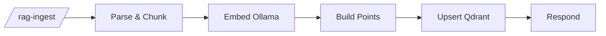

# RAG ingest

`agent/n8n/workflows/bugsy-rag-ingest.json` — turns markdown documents into Qdrant vector points.

## Pipeline



- **Parse & Chunk** — strips YAML frontmatter, extracts `title` + `tags`, slices the body into ~400-char chunks with 50-char overlap. Emits one item per chunk.
- **Embed (Ollama)** — runs `nomic-embed-text` per chunk. Native HTTP Request node so n8n iterates per item automatically.
- **Build Points** — pairs each embedding with its source chunk metadata; UUIDs are deterministic from `title + chunk_index`.
- **Upsert (Qdrant)** — single PUT with the full point array.
- **Respond** — `✓ N chunks stored — <title>` or an error message with stage info.

## Adding content

```bash
# 1. Drop a markdown file with YAML frontmatter into the right category
cat > ~/agent/rag/bio/about-me.md <<'EOF'
---
title: About Anthony
tags: [bio, summary, voice]
---

I'm a full-stack engineer based in Austin...
EOF

# 2. Run the ingest helper
bash ~/agent/rag-ingest.sh           # all categories
bash ~/agent/rag-ingest.sh bio       # one category

# 3. Verify count went up
docker run --rm --network agent_agent-net curlimages/curl:latest \
  -s http://agent-qdrant:6333/collections/personal_knowledge | jq '.result.points_count'
```

## Categories

```
~/agent/rag/bio/            # resume, about-me, skills
~/agent/rag/articles/       # written/edited articles in your voice
~/agent/rag/case-studies/   # client work writeups
~/agent/rag/projects/       # project descriptions
```

`*.md` is gitignored — content stays private.

## Frontmatter

```markdown
---
title: My Resume
tags: [resume, react, node, typescript]
---

Body here.
```

`title` becomes the document's UUID seed and the value shown in `sources` from the query workflow. **Titles must be unique across the whole collection.**

## Idempotency

Re-running ingest on the same file overwrites those chunks because UUIDs are deterministic from `title + chunk_index`. Edit the file, re-run ingest, the existing points get updated rather than duplicated.

**Caveat:** if the doc shrinks (fewer chunks than before), trailing chunks from the previous version stay orphaned in Qdrant. Worth pruning manually if you regularly shorten docs:

```bash
# delete chunks for a title where chunk_index >= new total
docker run --rm --network agent_agent-net curlimages/curl:latest \
  -s -X POST http://agent-qdrant:6333/collections/personal_knowledge/points/delete \
  -H "Content-Type: application/json" \
  -d '{"filter":{"must":[{"key":"title","match":{"value":"My Resume"}},{"key":"chunk_index","range":{"gte":15}}]}}'
```

## Why no Code-node-with-axios?

Earlier this workflow looped axios calls inside one Code node. The n8n task runner subprocess died mid-loop with no recoverable error. Native HTTP Request nodes don't run in the runner sandbox and iterate per-item natively, so the refactor solved both problems at once.

## See also

- [RAG Query](rag-query.md) — read side of the same Qdrant collection
