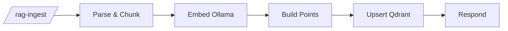

# RAG ingest

`agent/n8n/workflows/bugsy-rag-ingest.json` — turns markdown documents into Qdrant vector points.

## Pipeline



- **Parse & Chunk** — strips YAML frontmatter, resolves a `title` (frontmatter `title:` → first `# H1` → `filename` → `Untitled`), extracts `tags`, slices the body into ~400-char chunks with 50-char overlap. Emits one item per chunk.
- **Embed (Ollama)** — runs `nomic-embed-text` per chunk. Native HTTP Request node so n8n iterates per item automatically.
- **Build Points** — pairs each embedding with its source chunk metadata; UUIDs are deterministic from `doc_id + chunk_index` where `doc_id` is the relative `filename` (rename-safe and collision-free across repos), falling back to `title` for legacy callers.
- **Upsert (Qdrant)** — single PUT with the full point array.
- **Respond** — `✓ N chunks stored — <title>` or an error message with stage info.

## Adding content

```bash
# 1. Drop a markdown file with YAML frontmatter into the right category
cat > ~/agent/rag/bio/about-me.md <<'EOF'
---
title: About Anthony
tags: [bio, summary, voice]
---

I'm a full-stack engineer based in Austin...
EOF

# 2. Run the ingest helper
bash ~/agent/rag-ingest.sh           # all categories
bash ~/agent/rag-ingest.sh bio       # one category

# 3. Verify count went up
docker run --rm --network agent_agent-net curlimages/curl:latest \
  -s http://agent-qdrant:6333/collections/personal_knowledge | jq '.result.points_count'
```

## Categories

```
~/agent/rag/bio/            # resume, about-me, skills
~/agent/rag/articles/       # written/edited articles in your voice
~/agent/rag/case-studies/   # client work writeups
~/agent/rag/projects/       # project descriptions and source-repo doc trees
```

`*.md` is gitignored — content stays private.

## Cloning source repos for git-pull refresh

The ingest script walks subdirectories recursively (`find -L`) and follows symlinks, so any cloned repo's `docs/` tree can plug straight in. Pattern:

```bash
# 1. Clone the repo somewhere stable on the VM
git clone --depth=1 https://github.com/anthonycoffey/<repo>.git ~/<repo>

# 2. Symlink its docs into the right RAG category
ln -s ~/<repo>/docs ~/agent/rag/projects/<repo>

# 3. Ingest
bash ~/agent/rag-ingest.sh projects
```

Refresh later with:

```bash
cd ~/<repo> && git pull
bash ~/agent/rag-ingest.sh projects
```

Idempotency means re-ingesting the same files just overwrites their existing chunks (point IDs are deterministic from `doc_id + chunk_index`). New files are added; renamed files create new chunks at the new path and orphan the old ones — purge those manually if cleanliness matters.

Currently mounted this way: `~/agent/rag/projects/coffey-codes` → `~/coffey.codes/docs` (46 docs).

## Title resolution

The parser tries each source in order and uses the first one that yields a non-empty value:

1. **YAML frontmatter `title:`** — explicit, wins.
2. **First `# H1` heading** in the body — works for any well-formed markdown.
3. **`filename`** sent in the request body (relative path like `projects/_agent/architecture/overview.md`).
4. **`"Untitled"`** — only if everything above is missing.

This means most repos can be ingested as-is — no per-file frontmatter required. Add frontmatter when you want to override the H1 or specify `tags`:

```markdown
---
title: My Resume
tags: [resume, react, node, typescript]
---

Body here.
```

## Idempotency

Each chunk's Qdrant point ID is deterministic from `doc_id + chunk_index`, where `doc_id` is the request `filename` (preferred — rename-safe, collision-free across repos) or the title for legacy callers without a filename. Editing a file and re-running ingest overwrites its existing chunks rather than duplicating them.

**Two collisions to know about:**

- **Same filename in different categories** — won't collide because `rag-ingest.sh` sends `filename` as `<category>/<relative-path>`.
- **Same H1 in two repos** — only matters if neither file has frontmatter *and* neither caller sends a filename. The default script always sends a filename, so this only bites direct webhook callers.

**Caveat:** if the doc shrinks (fewer chunks than before), trailing chunks from the previous version stay orphaned in Qdrant. Worth pruning manually if you regularly shorten docs:

```bash
# delete chunks for a title where chunk_index >= new total
docker run --rm --network agent_agent-net curlimages/curl:latest \
  -s -X POST http://agent-qdrant:6333/collections/personal_knowledge/points/delete \
  -H "Content-Type: application/json" \
  -d '{"filter":{"must":[{"key":"title","match":{"value":"My Resume"}},{"key":"chunk_index","range":{"gte":15}}]}}'
```

## Why no Code-node-with-axios?

Earlier this workflow looped axios calls inside one Code node. The n8n task runner subprocess died mid-loop with no recoverable error. Native HTTP Request nodes don't run in the runner sandbox and iterate per-item natively, so the refactor solved both problems at once.

## See also

- [RAG Query](rag-query.md) — read side of the same Qdrant collection
