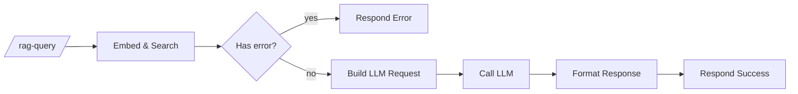

# RAG query (programmatic)

`agent/n8n/workflows/bugsy-rag-query.json` — JSON-over-HTTP endpoint for RAG-grounded answers. **Use this for testing, scripts, and non-Slack integrations.** The unified Bugsy workflow is the right entry point for human chat (it has memory; this one doesn't).

## Endpoint

```
POST https://n8n.coffey.codes/webhook/rag-query
Content-Type: application/json

{
  "question": "what are my strongest technical skills?",
  "top_k": 5     // optional, default 5
}
```

## Pipeline



- **Embed & Search** — Code node, embeds the question via Ollama and pulls top-K chunks from Qdrant. Returns `{error}` early if the question is missing/empty.
- **Has Error?** — IF node routes validation failures to a clean error response.
- **Build LLM Request** — Code node, constructs the Bugsy system prompt with retrieved context and builds the LiteLLM payload.
- **Call LLM** — HTTP Request to LiteLLM, authenticated via the `LiteLLM Bearer` Header Auth credential.
- **Format Response** — extracts the answer text and combines with `sources`.
- **Respond Success / Error** — JSON output.

## Responses

**Success:**
```json
{
  "answer": "Listen, boss, here's the rundown...",
  "sources": ["Anthony Coffey Resume"]
}
```

**Validation error:**
```json
{
  "error": "question is required and must be a non-empty string"
}
```

## Edge cases (verified)

| Input | Behavior |
|---|---|
| `{"question": ""}` | Clean validation error JSON |
| `{"q": "hello"}` (wrong key) | Clean validation error JSON |
| `{"question": "asdfgh"}` | Bugsy responds, low scores in retrieval, persona handles gracefully |
| Question with no relevant chunks | Bugsy says it doesn't know rather than hallucinating |
| Malformed JSON body | n8n returns 422 with parse error |

## Why this still exists alongside the unified workflow

- It's a clean programmatic API for scripts and testing
- Useful for diagnosing "is the RAG layer healthy?" without involving Slack
- Different shape — JSON in, JSON out — vs. the Slack-shaped unified workflow
