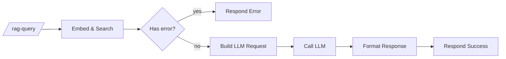
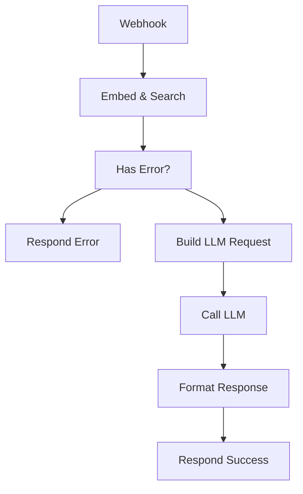

# RAG query (programmatic)

`agent/n8n/workflows/bugsy-rag-query.json` — JSON-over-HTTP endpoint for RAG-grounded answers. **Use this for testing, scripts, and non-Slack integrations.** The unified Bugsy workflow is the right entry point for human chat (it has memory; this one doesn't).

## Endpoint

```
POST https://n8n.coffey.codes/webhook/rag-query
Content-Type: application/json

{
  "question": "what are my strongest technical skills?",
  "top_k": 15    // optional, default 15
}
```

## Pipeline



- **Embed & Search** — Code node, embeds the question via Ollama and pulls top-K chunks from Qdrant. Returns `{error}` early if the question is missing/empty.
- **Has Error?** — IF node routes validation failures to a clean error response.
- **Build LLM Request** — Code node, constructs the Bugsy system prompt with retrieved context and builds the LiteLLM payload.
- **Call LLM** — HTTP Request to LiteLLM, authenticated via the `LiteLLM Bearer` Header Auth credential.
- **Format Response** — extracts the answer text and combines with `sources`.
- **Respond Success / Error** — JSON output.

## Responses

**Success:**
```json
{
  "answer": "Listen, boss, here's the rundown...",
  "sources": ["Anthony Coffey Resume"]
}
```

**Validation error:**
```json
{
  "error": "question is required and must be a non-empty string"
}
```

## Edge cases (verified)

| Input | Behavior |
|---|---|
| `{"question": ""}` | Clean validation error JSON |
| `{"q": "hello"}` (wrong key) | Clean validation error JSON |
| `{"question": "asdfgh"}` | Bugsy responds, low scores in retrieval, persona handles gracefully |
| Question with no relevant chunks | Bugsy says it doesn't know rather than hallucinating |
| Malformed JSON body | n8n returns 422 with parse error |

## Why this still exists alongside the unified workflow

- It's a clean programmatic API for scripts and testing
- Useful for diagnosing "is the RAG layer healthy?" without involving Slack
- Different shape — JSON in, JSON out — vs. the Slack-shaped unified workflow

<!-- NODE-REF:START:bugsy-rag-query — auto-generated by agent/n8n/scripts/generate-workflow-reference.mjs; do not edit by hand -->

## Node reference: Bugsy — RAG Query

> Auto-generated from `agent/n8n/workflows/bugsy-rag-query.json` on 2026-05-18. Run `node agent/n8n/scripts/generate-workflow-reference.mjs` to refresh.

**Active:** `true` · **Nodes:** 8 · **Execution order:** `v1`

### Flow



### Nodes

#### Webhook
*Type:* `n8n-nodes-base.webhook`

- **Method:** `POST`
- **Path:** `/rag-query`
- **Response mode:** `responseNode`

#### Embed & Search
*Type:* `n8n-nodes-base.code`

```javascript
const axios = require('axios');
const raw = $input.first().json;
const body = raw.body || raw;
const question = body.question;
const topK = body.top_k || 15;

if (!question || typeof question !== 'string' || !question.trim()) {
  return [{ json: { error: 'question is required and must be a non-empty string' } }];
}

const embedRes = await axios.post('http://ollama:11434/api/embeddings', {
  model: 'nomic-embed-text',
  prompt: question
});

const searchRes = await axios.post('http://qdrant:6333/collections/personal_knowledge/points/search', {
  vector: embedRes.data.embedding,
  limit: topK,
  with_payload: true
});

const chunks = searchRes.data.result.map(r => ({
  text: r.payload.text,
  title: r.payload.title,
  category: r.payload.category,
  score: Math.round(r.score * 100) / 100
}));

return [{ json: { question, chunks } }];
```

#### Has Error?
*Type:* `n8n-nodes-base.if`

*Combinator:* `and`

- `={{ $json.error }}` **notEmpty** ``

#### Respond Error
*Type:* `n8n-nodes-base.respondToWebhook`

- **Respond with:** `json`

**Body:**
```json
={{ JSON.stringify({ error: $json.error }) }}
```

#### Build LLM Request
*Type:* `n8n-nodes-base.code`

```javascript
const { question, chunks } = $input.first().json;

const context = chunks.length
  ? chunks.map((c, i) => '[' + (i+1) + '] ' + c.title + '\n' + c.text).join('\n\n')
  : 'No relevant context found in knowledge base.';

const systemPrompt = 'You are Bugsy, a sharp 1970s New York Italian fixer who also happens to be a highly capable AI assistant. Call the user "boss." Lead with useful, accurate information drawn from the context — the persona is flavor, not filler. Keep answers tight and grounded. If the context is insufficient, say so straight.\n\nCONTEXT FROM BOSS\'S KNOWLEDGE BASE:\n' + context;

const sources = [...new Set(chunks.map(c => c.title))];

return [{
  json: {
    payload: {
      model: 'claude-haiku-4-5',
      messages: [
        { role: 'system', content: systemPrompt },
        { role: 'user', content: question }
      ]
    },
    sources
  }
}];
```

#### Call LLM
*Type:* `n8n-nodes-base.httpRequest`

- **Method:** `POST`
- **URL:** `http://litellm:4000/v1/chat/completions`
- **Auth:** `genericCredentialType` (httpHeaderAuth)
- **Timeout:** 60000ms

**Headers:**
- `Content-Type`: `application/json`

**Body:**
```json
={{ JSON.stringify($json.payload) }}
```

- **Credential (httpHeaderAuth):** `LiteLLM Bearer`

#### Format Response
*Type:* `n8n-nodes-base.code`

```javascript
const llm = $input.first().json;
const sources = $('Build LLM Request').first().json.sources;
const answer = llm.choices && llm.choices[0] && llm.choices[0].message && llm.choices[0].message.content
  ? llm.choices[0].message.content
  : 'Boss, somethin\'s off — the LLM came back empty. Check the logs.';
return [{ json: { answer, sources } }];
```

#### Respond Success
*Type:* `n8n-nodes-base.respondToWebhook`

- **Respond with:** `json`

**Body:**
```json
={{ JSON.stringify({ answer: $json.answer, sources: $json.sources }) }}
```

<!-- NODE-REF:END:bugsy-rag-query -->
